# ЧТЗ: Кабинет администратора

## Версия: 1.0
## Дата: 03.03.2026
## Автор: Business/System Analyst
## Приоритет: High

---

## 1. Общая информация

### 1.1 Название проекта
Разработка полнофункционального кабинета администратора для управления веб-приложением "Заборы и навесы"

### 1.2 Версия документа
1.0 (черновик)

### 1.3 Ответственные
- Инициатор: Заказчик
- Аналитик: Business/System Analyst
- Техлид: TBD

### 1.4 Приоритет
**High** - критический функционал для управления бизнесом

---

## 2. Цели и задачи

### 2.1 Бизнес-цель
Создать централизованную административную панель для эффективного управления материалами, ценами, заявками клиентов и контентом сайта без участия разработчиков.

### 2.2 Пользовательская ценность
Администраторы и менеджеры получают удобный интерфейс для оперативного управления всеми аспектами бизнеса: от актуализации цен до обработки клиентских заявок, с полной аналитикой и историей изменений.

### 2.3 Ключевые метрики успеха
- Время обновления цен < 5 минут
- Время обработки заявки < 10 минут
- Успешность авторизации 100%
- Доступность админки 99.9%
- Конверсия обработки заявок ≥ 90%

---

## 3. Требования к продукту

### 3.1 Функциональные требования

#### Структура административной панели

**Вкладки кабинета администратора:**

1. **Дашборд** - главная страница со статистикой
2. **Материалы заборов** - управление данными для расчета стоимости забора
3. **Материалы навесов** - управление данными для расчета стоимости навеса
4. **Заявки клиентов** - управление входящими заявками
5. **Цены** - управление прайс-листами и наценками
6. **Контент** - управление контентом сайта
7. **Пользователи** - управление пользователями и правами
8. **Статистика** - детальная аналитика

---

### 3.1.1 Вкладка "Дашборд"

**User Story 1: Просмотр ключевой статистики**
*Как администратор, я хочу видеть ключевую статистику бизнеса на одной странице, чтобы быстро оценить текущую ситуацию.*

**Acceptance Criteria:**
- Виджеты с ключевыми метриками:
  - Новые заявки за сегодня/неделю/месяц
  - Общее количество заявок в работе
  - Количество завершенных заказов
  - Средний чек заказа
  - Конверсия (расчет → заявка)
- Графики:
  - Количество заявок по дням (линейный график)
  - Распределение по типам услуг (круговая диаграмма)
  - Топ-5 регионов по количеству заявок
- Быстрые действия:
  - Ссылка на последние 5 заявок
  - Кнопка "Предпросмотр калькулятора"
  - Уведомления о новых заявках
- Фильтрация по периодам (сегодня, неделя, месяц, квартал, год)

---

### 3.1.2 Вкладка "Материалы заборов"

**User Story 2: Управление типами заборов**
*Как менеджер, я хочу управлять типами заборов, чтобы добавлять новые и редактировать существующие.*

**Acceptance Criteria:**
- Список типов заборов с таблицей (пагинация 20 записей)
- Колонки: Название, Изображение, Коэффициент сложности, Активность, Действия
- CRUD операции:
  - Создание нового типа (название, описание, изображение, коэффициент сложности, активность)
  - Редактирование типа
  - Активация/деактивация
  - Удаление (с проверкой на использование)
- Поиск по названию
- Фильтрация по активности
- Сортировка по порядку отображения

**User Story 3: Управление материалами для заборов**
*Как менеджер, я хочу управлять справочником материалов, чтобы актуализировать цены и добавлять новые.*

**Acceptance Criteria:**
- Список материалов с таблицей (пагинация 20 записей)
- Колонки: Название, Категория, Цена, Единица, Активность, Действия
- Фильтрация по категориям:
  - Профнастил
  - Евроштакетник
  - Сетка
  - 3D-панели
  - Столбы
  - Лаги
  - Ворота
  - Калитки
  - Крепеж
- CRUD операции:
  - Создание материала (все поля из модели FenceMaterial)
  - Редактирование материала
  - Активация/деактивация
  - Удаление (с проверкой на использование)
- Массовое обновление цен (batch operation)
- Экспорт в Excel/CSV
- Импорт из Excel/CSV
- История изменений цен (логирование)

**User Story 4: Управление типами столбов**
*Как менеджер, я хочу управлять типами столбов с доступными толщинами и ценами.*

**Acceptance Criteria:**
- Список типов столбов с таблицей
- Колонки: Название, Сечение, Доступные толщины, Цена за м.п., Цена с бетоном, Активность, Действия
- CRUD операции:
  - Создание типа (название, сечение, доступные толщины, цены по толщинам)
  - Редактирование типа
  - Удаление (с проверкой на использование)
- Управление ценами по толщинам

**User Story 5: Управление типами грунта**
*Как менеджер, я хочу управлять коэффициентами удорожания для разных типов грунта.*

**Acceptance Criteria:**
- Список типов грунта с таблицей
- CRUD операции:
  - Создание типа (название, коэффициент удорожания)
  - Редактирование типа
  - Удаление (с проверкой на использование)

**User Story 6: Управление ценами на работы**
*Как менеджер, я хочу управлять ценами на монтажные работы.*

**Acceptance Criteria:**
- Список цен на работу с таблицей
- Категории работ:
  - Монтаж забора (за м.п.)
  - Монтаж ворот
  - Монтаж калитки
  - Бетонирование столбов
  - Доставка
- CRUD операции для цен
- История изменений цен

**User Story 7: Управление опциями ворот**
*Как менеджер, я хочу указывать стоимость дополнительных опций для ворот.*

**Acceptance Criteria:**
- Список опций для ворот
- CRUD операции:
  - Создание опции (название, тип цены: фиксированная/процент, значение)
  - Редактирование опции
  - Удаление опции

---

### 3.1.3 Вкладка "Материалы навесов"

**User Story 8: Управление типами навесов**
*Как менеджер, я хочу управлять типами навесов.*

**Acceptance Criteria:**
- Список типов навесов с таблицей
- CRUD операции:
  - Создание типа (название, описание, изображение, коэффициент площади, коэффициент расхода)
  - Редактирование типа
  - Удаление (с проверкой на использование)

**User Story 9: Управление материалами для навесов**
*Как менеджер, я хочу управлять справочником материалов для навесов.*

**Acceptance Criteria:**
- Список материалов с таблицей (пагинация 20 записей)
- Фильтрация по категориям:
  - Поликарбонат
  - Профнастил
  - Металлочерепица
  - Профиль
  - Крепеж
  - Водосточная система
- CRUD операции:
  - Создание материала (все поля из модели CanopyMaterial)
  - Редактирование материала
  - Активация/деактивация
  - Удаление (с проверкой на использование)
- Массовое обновление цен
- Экспорт/импорт в Excel/CSV
- История изменений цен

**User Story 10: Управление типами каркаса**
*Как менеджер, я хочу управлять типами каркаса для навесов.*

**Acceptance Criteria:**
- Список типов каркаса
- CRUD операции:
  - Создание типа (название, сечение профиля, толщина стенки, цена за м.п.)
  - Редактирование типа
  - Удаление (с проверкой на использование)

---

### 3.1.4 Вкладка "Заявки клиентов"

**User Story 11: Просмотр списка заявок**
*Как менеджер, я хочу видеть список всех заявок с возможностью фильтрации.*

**Acceptance Criteria:**
- Список заявок с таблицей (пагинация 20 записей)
- Колонки: ID, Дата, Клиент, Телефон, Тип услуги, Стоимость, Статус, Менеджер, Действия
- Фильтрация:
  - По статусу (новая, в работе, завершена, отменена)
  - По типу услуги (забор, навес)
  - По дате (диапазон дат)
  - По менеджеру
- Поиск по имени клиента, телефону, email
- Сортировка по дате (по умолчанию - новые сверху)
- Экспорт в Excel/CSV
- Цветовая индикация статусов:
  - Новая - зеленый
  - В работе - желтый
  - Завершена - серый
  - Отменена - красный

**User Story 12: Просмотр детальной информации о заявке**
*Как менеджер, я хочу видеть полную информацию о заявке с параметрами расчета.*

**Acceptance Criteria:**
- Модальное окно или отдельная страница с деталями заявки
- Информация о клиенте:
  - Имя, телефон, email
- Параметры расчета (из JSON parameters):
  - Для забора: тип, длина, высота, столбы, лаги, ворота, калитка и т.д.
  - Для навеса: тип, назначение, размеры, материалы и т.д.
- Расчетная стоимость с детализацией
- Статус заявки
- История изменений статуса с датами и пользователями
- Комментарий менеджера
- Назначенный менеджер

**User Story 13: Обработка заявки**
*Как менеджер, я хочу изменять статус заявки и добавлять комментарии.*

**Acceptance Criteria:**
- Изменение статуса (NEW → IN_PROGRESS → COMPLETED или CANCELLED)
- Добавление комментария менеджера (textarea, до 1000 символов)
- Назначение ответственного менеджера (выбор из списка)
- Автоматическое сохранение истории изменений:
  - Кто изменил
  - Когда изменил
  - Какое изменение (старый статус → новый статус)
- Уведомление о смене статуса (опционально)
- Кнопки действий:
  - "Позвонить клиенту" (tel: ссылка)
  - "Написать email" (mailto: ссылка)
  - "Скачать расчет PDF"

**User Story 14: Массовые операции с заявками**
*Как менеджер, я хочу выполнять массовые операции с заявками.*

**Acceptance Criteria:**
- Выбор нескольких заявок (чекбоксы)
- Массовые операции:
  - Изменение статуса
  - Назначение менеджера
  - Экспорт выбранных в Excel
  - Удаление (только для ADMIN)

---

### 3.1.5 Вкладка "Цены"

**User Story 15: Управление базовыми прайс-листами**
*Как менеджер, я хочу управлять базовыми ценами на услуги.*

**Acceptance Criteria:**
- Таблица с базовыми ценами
- Категории:
  - Стоимость монтажа за м² (по типам работ)
  - Стоимость доставки (по зонам)
  - Наценки за сложность
  - Сезонные коэффициенты
- CRUD операции для всех цен
- История изменений цен (дата, пользователь, старое значение, новое значение)
- Возможность отката к предыдущему значению

**User Story 16: Управление коэффициентами**
*Как менеджер, я хочу управлять коэффициентами удорожания.*

**Acceptance Criteria:**
- Список коэффициентов:
  - Коэффициент грунта
  - Коэффициент сложности монтажа
  - Сезонные коэффициенты
  - Региональные коэффициенты
- CRUD операции
- История изменений

---

### 3.1.6 Вкладка "Контент"

**User Story 17: Управление текстовыми страницами**
*Как контент-менеджер, я хочу редактировать текстовые страницы сайта.*

**Acceptance Criteria:**
- Список страниц (Главная, Услуги, Контакты и т.д.)
- Редактирование контента:
  - Блоки контента (текст, изображения, заголовки)
  - WYSIWYG редактор или markdown
- SEO-настройки:
  - Title (до 60 символов)
  - Description (до 160 символов)
  - Keywords (до 10 ключевых слов)
- Предпросмотр страницы
- Сохранение изменений

**User Story 18: Управление баннерами**
*Как контент-менеджер, я хочу управлять баннерами на главной странице.*

**Acceptance Criteria:**
- Список баннеров с таблицей
- CRUD операции:
  - Создание баннера (изображение, заголовок, текст, ссылка, порядок сортировки)
  - Редактирование баннера
  - Активация/деактивация
  - Удаление баннера
- Загрузка изображений (WebP, max 2MB)
- Предпросмотр баннера

**User Story 19: Управление портфолио**
*Как контент-менеджер, я хочу управлять портфолио работ.*

**Acceptance Criteria:**
- Список проектов с таблицей
- CRUD операции:
  - Создание проекта (название, категория, тип, описание, изображения, стоимость, показывать стоимость)
  - Редактирование проекта
  - Активация/деактивация
  - Удаление проекта
- Загрузка нескольких изображений (до 10 изображений на проект)
- Сортировка проектов
- Фильтрация по категории и типу

**User Story 20: Управление отзывами**
*Как контент-менеджер, я хочу управлять отзывами клиентов.*

**Acceptance Criteria:**
- Список отзывов с таблицей
- CRUD операции:
  - Создание отзыва (имя, текст, рейтинг 1-5, изображение опционально)
  - Редактирование отзыва
  - Активация/деактивация (модерация)
  - Удаление отзыва
- Сортировка отзывов
- Фильтрация по рейтингу и активности

**User Story 21: Управление настройками сайта**
*Как администратор, я хочу управлять общими настройками сайта.*

**Acceptance Criteria:**
- Редактирование контактной информации:
  - Название компании
  - Телефоны (несколько)
  - Email (несколько)
  - Адрес
  - Режим работы
- Реквизиты компании
- Ссылки на социальные сети
- Код Яндекс.Метрики / Google Analytics
- Код Яндекс.Карт

---

### 3.1.7 Вкладка "Пользователи"

**User Story 22: Управление пользователями**
*Как администратор, я хочу управлять пользователями админки.*

**Acceptance Criteria:**
- Список пользователей с таблицей
- Колонки: Email, Имя, Роль, Телефон, Активность, Дата регистрации, Последний вход, Действия
- CRUD операции:
  - Создание пользователя (email, пароль, имя, роль, телефон, активность)
  - Редактирование пользователя
  - Активация/деактивация
  - Удаление пользователя (нельзя удалить самого себя)
  - Сброс пароля
- Роли:
  - ADMIN - полный доступ ко всем функциям
  - MANAGER - работа с заявками, ценами, материалами (без удаления)
  - CONTENT_MANAGER - только контент и портфолио
- Фильтрация по ролям и активности
- Поиск по email и имени

**User Story 23: Управление правами доступа**
*Как администратор, я хочу настраивать права доступа для ролей.*

**Acceptance Criteria:**
- Таблица прав доступа по ролям
- Редактирование прав:
  - Дашборд: просмотр
  - Материалы: просмотр / создание / редактирование / удаление
  - Заявки: просмотр / редактирование / удаление
  - Цены: просмотр / редактирование
  - Контент: просмотр / редактирование
  - Пользователи: просмотр / создание / редактирование / удаление
  - Статистика: просмотр
- Сохранение изменений

---

### 3.1.8 Вкладка "Статистика"

**User Story 24: Просмотр детальной статистики**
*Как администратор, я хочу видеть детальную статистику работы сайта.*

**Acceptance Criteria:**
- Раздел "Расчеты":
  - Общее количество расчетов за период
  - По типам (заборы vs навесы)
  - По типам заборов (профнастил, штакетник и т.д.)
  - По типам навесов (односкатный, двускатный и т.д.)
  - По регионам
  - Средняя стоимость расчета
  - График расчетов по дням/неделям/месяцам

- Раздел "Заявки":
  - Общее количество заявок за период
  - По статусам (новые, в работе, завершенные, отмененные)
  - Конверсия (расчет → заявка)
  - Средняя стоимость заказа
  - Среднее время обработки заявки
  - График заявок по дням/неделям/месяцам

- Раздел "Финансы":
  - Общая сумма завершенных заказов
  - Средний чек
  - По менеджерам (кто сколько обработал)
  - По типам услуг

- Раздел "География":
  - Карта с регионами запросов
  - Топ-10 регионов по количеству заявок

- Фильтрация по периодам (день, неделя, месяц, квартал, год, кастомный период)
- Экспорт отчетов в Excel/CSV
- Печать отчетов

---

### 3.1.9 Дополнительные функции

**User Story 25: Предпросмотр калькулятора**
*Как менеджер, я хочу видеть актуальный калькулятор из админки, чтобы проверить изменения.*

**Acceptance Criteria:**
- Кнопка "Предпросмотр калькулятора" в шапке админки
- Открытие калькулятора в новой вкладке
- Использование актуальных данных из БД
- Возможность тестировать расчеты без создания заявки
- Индикатор "Режим предпросмотра"

**User Story 26: История изменений цен**
*Как менеджер, я хочу видеть историю изменений цен.*

**Acceptance Criteria:**
- Для каждого материала/цены доступна история изменений
- Отображение:
  - Дата и время изменения
  - Пользователь, внесший изменение
  - Старое значение
  - Новое значение
- Фильтрация по дате и пользователю
- Возможность отката к предыдущему значению (только ADMIN)
- Экспорт истории в Excel

**User Story 27: Email уведомления**
*Как менеджер, я хочу получать уведомления о новых заявках на email.*

**Acceptance Criteria:**
- Настройка уведомлений для каждого пользователя
- Типы уведомлений:
  - Новая заявка
  - Изменение статуса заявки
  - Назначение ответственного
- Настройка в профиле пользователя:
  - Включить/выключить уведомления
  - Выбрать типы уведомлений
  - Указать email для уведомлений
- Отправка уведомлений через Nodemailer + SMTP

**User Story 28: Telegram уведомления**
*Как менеджер, я хочу получать уведомления о новых заявках в Telegram.*

**Acceptance Criteria:**
- Настройка Telegram бота (bot token, chat ID)
- Уведомления о новых заявках
- Настройка в админке:
  - Включить/выключить Telegram уведомления
  - Указать chat ID для уведомлений
- Формат сообщения:
  - ID заявки
  - Имя клиента
  - Телефон
  - Тип услуги
  - Стоимость
  - Ссылка на заявку в админке

**User Story 29: Экспорт в Excel/CSV**
*Как менеджер, я хочу экспортировать данные из админки в Excel.*

**Acceptance Criteria:**
- Экспорт для разделов:
  - Материалы заборов
  - Материалы навесов
  - Заявки клиентов
  - Статистика
  - История изменений цен
- Форматы: Excel (.xlsx), CSV (.csv)
- Фильтрация перед экспортом (экспорт только отфильтрованных данных)
- Скачивание файла с уникальным именем (название_дата_время.xlsx)

---

### 3.2 Нефункциональные требования

#### 3.2.1 Производительность
- Время загрузки страниц админки < 2 секунд
- Время отклика API < 500 мс для CRUD операций
- Время экспорта данных < 10 секунд для 1000 записей
- Поддержка одновременной работы 10+ администраторов
- Пагинация списков (20-50 записей на странице)
- Lazy loading для таблиц и изображений
- Кеширование часто запрашиваемых данных в Redis (TTL 5 минут)

#### 3.2.2 Безопасность
- Авторизация required для всех страниц админки
- Ролевой доступ (RBAC):
  - ADMIN: полный доступ
  - MANAGER: заявки, материалы, цены (без удаления)
  - CONTENT_MANAGER: контент и портфолио
- Защита от CSRF (встроена в Next.js)
- Защита от XSS (санитизация пользовательского ввода)
- Rate limiting на API endpoints (100 запросов/мин на пользователя)
- Логирование всех действий в админке (кто, что, когда)
- Блокировка пользователя после 5 неудачных попыток входа (15 минут)
- Автоматический выход из системы после 1 часа неактивности (настраиваемо)
- Пароли хешируются (bcrypt или argon2)

#### 3.2.3 Масштабируемость
- Поддержка до 1000 материалов в каждом разделе
- Поддержка до 10000 заявок в базе
- Возможность горизонтального масштабирования
- Оптимизация SQL запросов с индексами
- Кеширование часто запрашиваемых данных

#### 3.2.4 Доступность
- Поддержка keyboard navigation
- ARIA labels для всех интерактивных элементов
- Адаптивная верстка для планшетов (админка преимущественно desktop)
- Минимальное разрешение экрана: 1024px
- Контрастность цветов соответствует WCAG AA

#### 3.2.5 Совместимость
- Поддержка браузеров: Chrome, Firefox, Safari, Edge (последние 2 версии)
- Адаптивная верстка для планшетов (1024px+)
- Рекомендуется использовать desktop для комфортной работы

---

## 4. Техническая архитектура

### 4.1 Стек технологий (согласно существующей архитектуре)

| Компонент | Технология | Версия | Обоснование |
|-----------|------------|--------|-------------|
| Frontend | Next.js | 14.x (App Router) | SSR/SSG, React Server Components |
| Backend | Next.js API Routes | 14.x | REST API в едином проекте |
| Language | TypeScript | 5.x | Типобезопасность |
| Styling | Tailwind CSS | 3.x | Быстрая разработка |
| Components | shadcn/ui | latest | Готовые компоненты |
| Forms | React Hook Form | 7.x + Zod | Валидация |
| State | Zustand | 4.x | State management |
| Tables | TanStack Table | 8.x | Мощные таблицы с фильтрацией |
| Charts | Recharts | 2.x | Графики для статистики |
| Export | xlsx | latest | Экспорт в Excel |
| ORM | Prisma | 5.x | Типобезопасный ORM |
| Database | PostgreSQL | 16.x | Надежность, JSON |
| Cache | Redis | 7.x | Кеширование |
| Auth | NextAuth.js | 5.x | Аутентификация |
| Email | Nodemailer | 6.x | Email уведомления |
| Telegram | node-telegram-bot-api | latest | Telegram уведомления |

### 4.2 Интеграционные точки

#### Внешние сервисы
| Сервис | Назначение |
|--------|------------|
| Nodemailer + SMTP | Email-уведомления |
| Telegram Bot API | Уведомления менеджерам |
| Redis | Кеширование данных |

#### Внутренние сервисы
- Calculator Engine (сервис расчетов)
- Email Service (отправка email)
- Telegram Service (отправка уведомлений)
- Export Service (экспорт данных)
- Audit Log Service (логирование действий)

### 4.3 Схема данных (использование существующих моделей с расширениями)

Существующие модели из Prisma Schema:
- `User` - пользователи
- `FenceMaterial` - материалы для заборов
- `CanopyMaterial` - материалы для навесов
- `FenceType` - типы заборов
- `CanopyType` - типы навесов
- `PostType` - типы столбов
- `SoilType` - типы грунта
- `WorkPrice` - цены на работы
- `GateOption` - опции ворот
- `Order` - заявки
- `PortfolioItem` - портфолио
- `Review` - отзывы
- `PageContent` - контент страниц
- `Setting` - настройки сайта

**Новые модели для админки:**

```prisma
// История изменений цен
model PriceHistory {
  id          String   @id @default(cuid())
  entityType  String   // FenceMaterial, CanopyMaterial, WorkPrice, etc.
  entityId    String   // ID измененной сущности
  fieldName   String   // Какое поле изменено (basePrice, pricePerMeter и т.д.)
  oldValue    String   // Старое значение (JSON для сложных структур)
  newValue    String   // Новое значение (JSON для сложных структур)
  changedBy   String   // ID пользователя
  changedAt   DateTime @default(now())
  user        User     @relation(fields: [changedBy], references: [id])
}

// Лог действий в админке
model AdminActionLog {
  id          String   @id @default(cuid())
  userId      String
  user        User     @relation(fields: [userId], references: [id])
  action      String   // CREATE, UPDATE, DELETE, LOGIN, LOGOUT, etc.
  entityType  String   // Order, Material, User, etc.
  entityId    String?  // ID сущности (если применимо)
  details     Json?    // Дополнительные детали действия
  ipAddress   String?
  userAgent   String?
  createdAt   DateTime @default(now())
}

// Настройки уведомлений пользователя
model UserNotificationSettings {
  id                    String   @id @default(cuid())
  userId                String   @unique
  user                  User     @relation(fields: [userId], references: [id])
  emailNotifications    Boolean  @default(true)
  telegramNotifications Boolean  @default(false)
  telegramChatId        String?
  notifyNewOrder        Boolean  @default(true)
  notifyStatusChange    Boolean  @default(true)
  notifyAssignment      Boolean  @default(true)
  createdAt             DateTime @default(now())
  updatedAt             DateTime @updatedAt
}

// Расширение модели User
model User {
  id                    String   @id @default(cuid())
  email                 String   @unique
  name                  String?
  password              String
  role                  Role     @default(MANAGER)
  phone                 String?
  active                Boolean  @default(true)
  lastLoginAt           DateTime?
  createdAt             DateTime @default(now())
  updatedAt             DateTime @updatedAt
  
  // Новые связи
  priceHistory          PriceHistory[]
  actionLogs            AdminActionLog[]
  notificationSettings  UserNotificationSettings?
  assignedOrders        Order[]  @relation("AssignedOrders")
}
```

### 4.4 Архитектура сервисов

```
src/
├── app/
│   ├── (admin)/
│   │   └── admin/
│   │       ├── layout.tsx              # Layout с проверкой auth
│   │       ├── dashboard/
│   │       │   └── page.tsx            # Дашборд
│   │       ├── materials/
│   │       │   ├── fence/
│   │       │   │   ├── page.tsx        # Список материалов заборов
│   │       │   │   ├── types/
│   │       │   │   │   └── page.tsx    # Типы заборов
│   │       │   │   ├── posts/
│   │       │   │   │   └── page.tsx    # Типы столбов
│   │       │   │   └── work-prices/
│   │       │   │       └── page.tsx    # Цены на работы
│   │       │   └── canopy/
│   │       │       ├── page.tsx        # Список материалов навесов
│   │       │       └── types/
│   │       │           └── page.tsx    # Типы навесов
│   │       ├── orders/
│   │       │   ├── page.tsx            # Список заявок
│   │       │   └── [id]/
│   │       │       └── page.tsx        # Детали заявки
│   │       ├── prices/
│   │       │   └── page.tsx            # Управление ценами
│   │       ├── content/
│   │       │   ├── page.tsx            # Управление контентом
│   │       │   ├── portfolio/
│   │       │   │   └── page.tsx        # Портфолио
│   │       │   └── reviews/
│   │       │       └── page.tsx        # Отзывы
│   │       ├── users/
│   │       │   └── page.tsx            # Управление пользователями
│   │       ├── statistics/
│   │       │   └── page.tsx            # Статистика
│   │       └── settings/
│   │           └── page.tsx            # Настройки сайта
│   ├── api/
│   │   └── admin/
│   │       ├── materials/
│   │       │   ├── fence/
│   │       │   │   └── route.ts        # CRUD материалов заборов
│   │       │   └── canopy/
│   │       │       └── route.ts        # CRUD материалов навесов
│   │       ├── orders/
│   │       │   └── route.ts            # CRUD заявок
│   │       ├── prices/
│   │       │   └── route.ts            # Управление ценами
│   │       ├── content/
│   │       │   └── route.ts            # Управление контентом
│   │       ├── users/
│   │       │   └── route.ts            # CRUD пользователей
│   │       ├── statistics/
│   │       │   └── route.ts            # Статистика
│   │       ├── export/
│   │       │   └── route.ts            # Экспорт данных
│   │       └── audit-log/
│   │           └── route.ts            # Лог действий
├── services/
│   ├── admin/
│   │   ├── materialsService.ts         # Сервис материалов
│   │   ├── ordersService.ts            # Сервис заявок
│   │   ├── usersService.ts             # Сервис пользователей
│   │   ├── statisticsService.ts        # Сервис статистики
│   │   ├── exportService.ts            # Сервис экспорта
│   │   └── auditLogService.ts          # Сервис логирования
│   ├── notifications/
│   │   ├── emailService.ts             # Email уведомления
│   │   └── telegramService.ts          # Telegram уведомления
│   └── auth/
│       └── authService.ts              # Авторизация
├── lib/
│   ├── prisma.ts                       # Prisma client
│   ├── redis.ts                        # Redis client
│   ├── auth.ts                         # NextAuth config
│   ├── validators/
│   │   ├── admin.ts                    # Валидаторы для админки
│   │   └── orders.ts                   # Валидаторы заявок
│   └── permissions/
│       └── rbac.ts                     # Ролевой доступ
└── components/
    └── admin/
        ├── Dashboard/
        │   ├── DashboardWidgets.tsx
        │   └── DashboardCharts.tsx
        ├── Materials/
        │   ├── MaterialsTable.tsx
        │   └── MaterialForm.tsx
        ├── Orders/
        │   ├── OrdersTable.tsx
        │   └── OrderDetails.tsx
        ├── Users/
        │   ├── UsersTable.tsx
        │   └── UserForm.tsx
        ├── Statistics/
        │   └── StatisticsCharts.tsx
        └── Shared/
            ├── AdminLayout.tsx
            ├── Sidebar.tsx
            ├── DataTable.tsx
            ├── FilterBar.tsx
            └── ExportButton.tsx
```

---

## 5. API спецификация

### 5.1 Административные API (требуется auth)

Все API endpoints требуют авторизации через NextAuth.js.

#### GET /api/admin/dashboard
Получение данных для дашборда

**Auth:** Required (ADMIN, MANAGER, CONTENT_MANAGER)

**Query params:**
- period?: string (day|week|month|quarter|year)

**Response 200:**
```json
{
  "stats": {
    "newOrdersToday": 5,
    "ordersInProgress": 12,
    "completedOrders": 45,
    "averageOrderCost": 85000,
    "conversionRate": 15.5
  },
  "charts": {
    "ordersByDay": [
      { "date": "2026-03-01", "count": 10 },
      { "date": "2026-03-02", "count": 8 }
    ],
    "ordersByType": {
      "fence": 70,
      "canopy": 30
    },
    "topRegions": [
      { "region": "Москва", "count": 50 },
      { "region": "СПб", "count": 20 }
    ]
  },
  "recentOrders": [
    {
      "id": "order-id",
      "clientName": "Иван Иванов",
      "serviceType": "fence",
      "calculatedCost": 100000,
      "createdAt": "2026-03-03T10:00:00Z"
    }
  ]
}
```

#### GET /api/admin/materials/fence
Получение списка материалов заборов

**Auth:** Required (ADMIN, MANAGER, CONTENT_MANAGER)

**Query params:**
- category?: string
- page?: number (default 1)
- pageSize?: number (default 20)
- active?: boolean
- search?: string

**Response 200:**
```json
{
  "materials": [
    {
      "id": "material-id",
      "name": "Профнастил С8",
      "category": "PROFNASTIL",
      "unit": "м²",
      "basePrice": 450,
      "availableThicknesses": [0.4, 0.5, 0.6, 0.7],
      "thicknessPrices": [
        { "thickness": 0.4, "price": 400 },
        { "thickness": 0.5, "price": 450 }
      ],
      "active": true,
      "sortOrder": 1,
      "createdAt": "2026-03-01T10:00:00Z",
      "updatedAt": "2026-03-03T10:00:00Z"
    }
  ],
  "total": 50,
  "page": 1,
  "pageSize": 20
}
```

#### POST /api/admin/materials/fence
Создание материала забора

**Auth:** Required (ADMIN, CONTENT_MANAGER)

**Request:**
```json
{
  "name": "Новый материал",
  "category": "PROFNASTIL",
  "unit": "м²",
  "basePrice": 500,
  "description": "Описание",
  "image": "/images/material.jpg",
  "thickness": 0.5,
  "width": 1.0,
  "height": 2.0,
  "coating": "Оцинковка",
  "availableThicknesses": [0.4, 0.5, 0.6],
  "thicknessPrices": [
    { "thickness": 0.4, "price": 450 },
    { "thickness": 0.5, "price": 500 },
    { "thickness": 0.6, "price": 550 }
  ],
  "active": true,
  "sortOrder": 0
}
```

**Response 201:**
```json
{
  "id": "new-material-id"
}
```

#### PUT /api/admin/materials/fence/:id
Обновление материала забора

**Auth:** Required (ADMIN, CONTENT_MANAGER)

**Request:** (как при создании)

**Response 200:**
```json
{
  "success": true
}
```

#### DELETE /api/admin/materials/fence/:id
Удаление материала забора

**Auth:** Required (ADMIN)

**Response 200:**
```json
{
  "success": true
}
```

#### PUT /api/admin/materials/fence/batch-update
Массовое обновление цен

**Auth:** Required (ADMIN, MANAGER)

**Request:**
```json
{
  "updates": [
    {
      "id": "material-id-1",
      "basePrice": 550
    },
    {
      "id": "material-id-2",
      "basePrice": 600
    }
  ]
}
```

**Response 200:**
```json
{
  "success": true,
  "updated": 2
}
```

#### GET /api/admin/orders
Получение списка заявок

**Auth:** Required (ADMIN, MANAGER)

**Query params:**
- status?: string (NEW|IN_PROGRESS|COMPLETED|CANCELLED)
- serviceType?: string (fence|canopy)
- dateFrom?: string (ISO date)
- dateTo?: string (ISO date)
- assignedTo?: string (user ID)
- page?: number
- pageSize?: number
- search?: string

**Response 200:**
```json
{
  "orders": [
    {
      "id": "order-id",
      "clientName": "Иван Иванов",
      "phone": "+79001234567",
      "email": "ivan@example.com",
      "serviceType": "fence",
      "calculatedCost": 100000,
      "status": "NEW",
      "assignedTo": "manager-id",
      "assignedUserName": "Менеджер",
      "createdAt": "2026-03-03T10:00:00Z",
      "updatedAt": "2026-03-03T10:00:00Z"
    }
  ],
  "total": 100,
  "page": 1,
  "pageSize": 20
}
```

#### GET /api/admin/orders/:id
Получение детальной информации о заявке

**Auth:** Required (ADMIN, MANAGER)

**Response 200:**
```json
{
  "id": "order-id",
  "clientName": "Иван Иванов",
  "phone": "+79001234567",
  "email": "ivan@example.com",
  "serviceType": "fence",
  "parameters": {
    "fenceType": "PROFNASTIL",
    "length": 50,
    "height": 2.0,
    "postType": "post-id",
    "postThickness": 2.5,
    "lagType": "lag-id",
    "lagThickness": 0.6,
    "lagRows": 2,
    "hasGate": true,
    "gateType": "распашные",
    "gateWidth": 4.0,
    "gateAutomatic": true,
    "hasWicket": true,
    "wicketWidth": 1.0,
    "coating": "GALVANIZED",
    "color": "5005",
    "soilType": "soil-id",
    "region": "Москва"
  },
  "calculatedCost": 100000,
  "status": "NEW",
  "managerComment": "",
  "assignedTo": "manager-id",
  "assignedUser": {
    "id": "manager-id",
    "name": "Менеджер"
  },
  "statusHistory": [
    {
      "status": "NEW",
      "timestamp": "2026-03-03T10:00:00Z",
      "userId": "system",
      "userName": "Система"
    }
  ],
  "createdAt": "2026-03-03T10:00:00Z",
  "updatedAt": "2026-03-03T10:00:00Z"
}
```

#### PUT /api/admin/orders/:id
Обновление заявки

**Auth:** Required (ADMIN, MANAGER)

**Request:**
```json
{
  "status": "IN_PROGRESS",
  "managerComment": "Клиент перезвонил, обсудили детали",
  "assignedTo": "manager-id"
}
```

**Response 200:**
```json
{
  "success": true
}
```

#### GET /api/admin/statistics
Получение детальной статистики

**Auth:** Required (ADMIN, MANAGER)

**Query params:**
- period?: string (day|week|month|quarter|year)
- dateFrom?: string
- dateTo?: string

**Response 200:**
```json
{
  "calculations": {
    "total": 1000,
    "byType": {
      "fence": 700,
      "canopy": 300
    },
    "byFenceType": {
      "PROFNASTIL": 400,
      "SHAKHETNIK": 200,
      "MESH": 50,
      "PANELS_3D": 50
    },
    "byRegion": {
      "Москва": 500,
      "СПб": 200,
      "Другие": 300
    },
    "averageCost": 85000,
    "byDay": [
      { "date": "2026-03-01", "count": 10 },
      { "date": "2026-03-02", "count": 8 }
    ]
  },
  "orders": {
    "total": 100,
    "byStatus": {
      "NEW": 20,
      "IN_PROGRESS": 30,
      "COMPLETED": 45,
      "CANCELLED": 5
    },
    "conversion": 10,
    "averageCost": 95000,
    "averageProcessingTime": 2.5,
    "byDay": [
      { "date": "2026-03-01", "count": 2 },
      { "date": "2026-03-02", "count": 3 }
    ]
  },
  "finance": {
    "totalRevenue": 4500000,
    "averageCheck": 95000,
    "byManager": [
      { "managerId": "manager-1", "name": "Менеджер 1", "count": 30, "revenue": 1500000 },
      { "managerId": "manager-2", "name": "Менеджер 2", "count": 15, "revenue": 750000 }
    ]
  },
  "geography": {
    "topRegions": [
      { "region": "Москва", "count": 50 },
      { "region": "СПб", "count": 20 }
    ]
  }
}
```

#### GET /api/admin/users
Получение списка пользователей

**Auth:** Required (ADMIN)

**Query params:**
- role?: string
- active?: boolean
- page?: number
- pageSize?: number
- search?: string

**Response 200:**
```json
{
  "users": [
    {
      "id": "user-id",
      "email": "admin@fences.ru",
      "name": "Администратор",
      "role": "ADMIN",
      "phone": "+79001234567",
      "active": true,
      "lastLoginAt": "2026-03-03T10:00:00Z",
      "createdAt": "2026-03-01T10:00:00Z"
    }
  ],
  "total": 10,
  "page": 1,
  "pageSize": 20
}
```

#### POST /api/admin/users
Создание пользователя

**Auth:** Required (ADMIN)

**Request:**
```json
{
  "email": "new@fences.ru",
  "password": "password123",
  "name": "Новый менеджер",
  "role": "MANAGER",
  "phone": "+79001234567",
  "active": true
}
```

**Response 201:**
```json
{
  "id": "new-user-id"
}
```

#### PUT /api/admin/users/:id
Обновление пользователя

**Auth:** Required (ADMIN)

**Request:** (как при создании, без password если не меняется)

**Response 200:**
```json
{
  "success": true
}
```

#### DELETE /api/admin/users/:id
Удаление пользователя

**Auth:** Required (ADMIN)

**Response 200:**
```json
{
  "success": true
}
```

#### GET /api/admin/price-history
Получение истории изменений цен

**Auth:** Required (ADMIN, MANAGER)

**Query params:**
- entityType?: string
- entityId?: string
- dateFrom?: string
- dateTo?: string
- page?: number
- pageSize?: number

**Response 200:**
```json
{
  "history": [
    {
      "id": "history-id",
      "entityType": "FenceMaterial",
      "entityId": "material-id",
      "entityName": "Профнастил С8",
      "fieldName": "basePrice",
      "oldValue": "400",
      "newValue": "450",
      "changedBy": "manager-id",
      "changedByName": "Менеджер",
      "changedAt": "2026-03-03T10:00:00Z"
    }
  ],
  "total": 100,
  "page": 1,
  "pageSize": 20
}
```

#### GET /api/admin/export
Экспорт данных

**Auth:** Required (ADMIN, MANAGER)

**Query params:**
- type: string (materials|orders|statistics|price-history)
- format: string (xlsx|csv)
- filters?: JSON string

**Response 200:**
- Content-Type: application/vnd.openxmlformats-officedocument.spreadsheetml.sheet (для xlsx)
- Content-Type: text/csv (для csv)
- Body: файл

#### GET /api/admin/audit-log
Получение лога действий

**Auth:** Required (ADMIN)

**Query params:**
- userId?: string
- action?: string
- entityType?: string
- dateFrom?: string
- dateTo?: string
- page?: number
- pageSize?: number

**Response 200:**
```json
{
  "logs": [
    {
      "id": "log-id",
      "userId": "user-id",
      "userName": "Администратор",
      "action": "UPDATE",
      "entityType": "Order",
      "entityId": "order-id",
      "details": {
        "field": "status",
        "oldValue": "NEW",
        "newValue": "IN_PROGRESS"
      },
      "ipAddress": "192.168.1.1",
      "createdAt": "2026-03-03T10:00:00Z"
    }
  ],
  "total": 500,
  "page": 1,
  "pageSize": 20
}
```

---

## 6. UI/UX требования

### 6.1 Дизайн

**Принципы дизайна:**
- Минималистичный профессиональный стиль
- Цветовая схема: синий (primary), серый (secondary), белый (background)
- Единообразие всех элементов интерфейса
- Четкая визуальная иерархия
- Адаптивность для планшетов (1024px+)

**Цветовая палитра:**
- Primary: #3B82F6 (синий)
- Secondary: #64748B (серый)
- Success: #10B981 (зеленый)
- Warning: #F59E0B (желтый)
- Error: #EF4444 (красный)
- Background: #F8FAFC (светло-серый)
- Text: #1E293B (темно-серый)

### 6.2 Потоки пользователя

**Вход в админку:**
1. Пользователь переходит на /admin/login
2. Вводит email и пароль
3. При успешной авторизации перенаправляется на /admin/dashboard
4. Видит дашборд с ключевой статистикой

**Управление материалами:**
1. Переходит в раздел "Материалы заборов"
2. Видит список материалов с фильтрами
3. Кликает "Создать" для добавления нового материала
4. Заполняет форму и сохраняет
5. Материал появляется в списке

**Обработка заявки:**
1. Переходит в раздел "Заявки"
2. Видит список заявок, фильтрует по статусу "Новые"
3. Кликает на заявку для просмотра деталей
4. Изменяет статус на "В работе"
5. Добавляет комментарий
6. Назначает ответственного менеджера (себя)
7. Сохраняет изменения

**Экспорт данных:**
1. Переходит в нужный раздел (например, "Заявки")
2. Применяет фильтры (если нужно)
3. Кликает "Экспорт в Excel"
4. Скачивает файл

### 6.3 Ключевые экраны

**Дашборд:**
- Виджеты с метриками (карточки)
- Графики (Recharts)
- Список последних заявок
- Быстрые действия

**Список материалов/заявок/пользователей:**
- Фильтры и поиск (top bar)
- Таблица с данными (TanStack Table)
- Пагинация (bottom)
- Кнопка "Создать"
- Кнопка "Экспорт"

**Форма создания/редактирования:**
- Модальное окно или отдельная страница
- Поля формы с валидацией
- Кнопки "Сохранить" и "Отмена"
- Индикатор загрузки

**Детали заявки:**
- Информация о клиенте
- Параметры расчета
- История статусов
- Комментарий менеджера
- Действия (изменить статус, назначить менеджера)

### 6.4 Валидация на клиенте

- React Hook Form + Zod
- Показ ошибок inline рядом с полями
- Блокировка кнопки "Сохранить" при невалидной форме
- Индикатор загрузки при отправке
- Валидация email, телефона (regex для РФ)
- Валидация числовых полей (диапазоны)

### 6.5 Обработка ошибок

- Toast уведомления для успешных операций
- Error messages для ошибок валидации
- Error boundaries для критических ошибок
- Fallback UI при сетевых ошибках
- Дружелюбные сообщения об ошибках

---

## 7. Тестирование

### 7.1 Unit-тесты

**Что должно быть покрыто:**
- Сервисы админки (services/admin/*.ts)
- Валидаторы (lib/validators/admin.ts)
- Утилиты для экспорта (services/admin/exportService.ts)
- RBAC логика (lib/permissions/rbac.ts)

**Целевой охват:**
- Сервисы: ≥ 80%
- Валидаторы: ≥ 90%
- Утилиты: ≥ 80%

**Фреймворки:**
- Jest
- @testing-library/react

### 7.2 Integration-тесты

**Ключевые сценарии:**
- Авторизация в админке
- CRUD операции для материалов
- CRUD операции для заявок
- CRUD операции для пользователей
- Экспорт данных
- История изменений цен

**Фреймворки:**
- Jest + Supertest

### 7.3 E2E-тесты

**Основные пользовательские сценарии:**

**Scenario 1: Управление материалами**
```gherkin
Given Менеджер авторизован в админке
When Переходит в раздел "Материалы заборов"
And Кликает "Создать"
And Заполняет форму: название, категория, цена
When Сохраняет материал
Then Материал появляется в списке
And Материал доступен в калькуляторе
```

**Scenario 2: Обработка заявки**
```gherkin
Given Менеджер авторизован в админке
When Переходит в раздел "Заявки"
And Открывает новую заявку
And Меняет статус на "В работе"
And Добавляет комментарий
When Сохраняет изменения
Then Статус заявки обновлен
And История статусов обновлена
```

**Scenario 3: Экспорт данных**
```gherkin
Given Менеджер авторизован в админке
When Переходит в раздел "Заявки"
And Применяет фильтр по статусу "Завершенные"
And Кликает "Экспорт в Excel"
Then Скачивается Excel файл с отфильтрованными данными
```

**Фреймворки:**
- Playwright

---

## 8. Документация

### 8.1 Что должно быть задокументировано

**API документация:**
- Все административные API endpoints
- Примеры запросов/ответов
- Статусы ответов
- Требования к авторизации

**Руководства:**
- Руководство администратора (как пользоваться админкой)
- Руководство менеджера (как обрабатывать заявки)
- Руководство контент-менеджера (как редактировать контент)
- Описание ролей и прав доступа

### 8.2 Формат документации

- Markdown (.md)
- JSDoc для TypeScript
- Комментарии в коде для сложной логики

### 8.3 Обязательство разработчика (CRITICAL)

После завершения разработки разработчик ОБЯЗАН актуализировать:

**Минимальный набор:**
- ✅ ARCHITECTURE.md (добавить раздел об админке)
- ✅ API.md (добавить административные endpoints)
- ✅ README.md (инструкция по использованию админки)
- ✅ ADMIN_GUIDE.md (руководство администратора)

**Дополнительно:**
- ✅ PERMISSIONS.md (описание ролей и прав)
- ✅ AUDIT_LOG.md (описание системы логирования)

---

## 9. Итерации и планы

### 9.1 Этапы разработки

#### Итерация 1: Базовая структура (1-2 недели)

**Включает:**
- Layout админки с sidebar
- Авторизация и защита маршрутов
- Базовый дашборд с виджетами
- CRUD для материалов заборов
- CRUD для материалов навесов

**Критерии завершения:**
- ✅ Можно авторизоваться в админке
- ✅ Дашборд отображает статистику
- ✅ Можно создавать/редактировать материалы
- ✅ Материалы отображаются в калькуляторе

#### Итерация 2: Управление заявками (1-2 недели)

**Включает:**
- Список заявок с фильтрацией
- Детальный просмотр заявки
- Изменение статуса
- Назначение менеджера
- Комментарии
- История изменений статуса

**Критерии завершения:**
- ✅ Заявки отображаются в админке
- ✅ Можно изменять статус
- ✅ История статусов сохраняется

#### Итерация 3: Дополнительные функции (1-2 недели)

**Включает:**
- Управление ценами
- Управление контентом
- Управление пользователями
- Статистика и аналитика
- Экспорт в Excel/CSV
- Предпросмотр калькулятора

**Критерии завершения:**
- ✅ Все разделы админки работают
- ✅ Экспорт работает
- ✅ Статистика отображается

#### Итерация 4: Уведомления и логирование (1 неделя)

**Включает:**
- Email уведомления
- Telegram уведомления
- История изменений цен
- Логирование действий (audit log)
- Настройки уведомлений пользователя

**Критерии завершения:**
- ✅ Уведомления отправляются
- ✅ История цен сохраняется
- ✅ Действия логируются

#### Итерация 5: Тестирование и полировка (1 неделя)

**Включает:**
- Написание тестов
- Исправление багов
- Оптимизация производительности
- Документация

**Критерии завершения:**
- ✅ Все тесты проходят
- ✅ Документация актуализирована

### 9.2 Общий срок разработки
**5-8 недель** для полнофункциональной админки

---

## 10. Риски и зависимости

### 10.1 Технические риски

| Риск | Вероятность | Влияние | План управления |
|------|-------------|---------|-----------------|
| Сложность RBAC системы | Средняя | Среднее | Детальное проектирование прав, тестирование |
| Производительность при большом объеме данных | Низкая | Высокое | Пагинация, кеширование, оптимизация запросов |
| Проблемы с экспортом больших файлов | Средняя | Среднее | Потоковая обработка, ограничение объема |
| Проблемы с уведомлениями | Низкая | Низкое | Retry механизм, fallback |

### 10.2 Зависимости

**Внешние сервисы:**
- Email SMTP сервер
- Telegram Bot API (bot token, chat ID)
- Redis для кеширования

**Команда:**
- Дизайнер (для UI админки)
- Тестировщик (для QA)

**Заказчик:**
- Список пользователей админки с ролями
- Настройки уведомлений
- Тестовые данные для проверки

### 10.3 План по управлению рисками

1. **RBAC:** Детальное проектирование, code review, тестирование
2. **Производительность:** Кеширование, мониторинг, оптимизация
3. **Экспорт:** Потоковая обработка, тестирование на больших объемах
4. **Уведомления:** Retry механизм, логирование ошибок

---

## 11. Декомпозиция на задачи

### TASK-BCK-001: Настройка авторизации и защиты маршрутов
**Направление:** Backend
**Приоритет:** High
**Оценка:** 8 часов
**Зависимости:** -

**Описание:**
Настроить защиту маршрутов /admin/* через NextAuth.js. Реализовать проверку ролей (RBAC). Добавить middleware для проверки авторизации.

**Критерии приемки:**
- [ ] Все маршруты /admin/* защищены
- [ ] Неавторизованные пользователи перенаправляются на /admin/login
- [ ] Проверка ролей работает (ADMIN, MANAGER, CONTENT_MANAGER)
- [ ] Автоматический выход после 1 часа неактивности

**Технические детали:**
- Файлы: `src/middleware.ts`, `src/lib/auth.ts`, `src/lib/permissions/rbac.ts`
- Расширить модель User для поддержки lastLoginAt

---

### TASK-BCK-002: API для дашборда
**Направление:** Backend
**Приоритет:** High
**Оценка:** 12 часов
**Зависимости:** TASK-BCK-001

**Описание:**
Реализовать API endpoint для получения данных дашборда: статистика, графики, последние заявки.

**Критерии приемки:**
- [ ] GET /api/admin/dashboard возвращает статистику
- [ ] Возвращаются данные для графиков
- [ ] Возвращаются последние 5 заявок
- [ ] Фильтрация по периодам работает

**Технические детали:**
- Файл: `src/app/api/admin/dashboard/route.ts`
- Сервис: `src/services/admin/statisticsService.ts`
- Кеширование в Redis (TTL 5 минут)

---

### TASK-BCK-003: CRUD для материалов заборов
**Направление:** Backend
**Приоритет:** High
**Оценка:** 16 часов
**Зависимости:** TASK-BCK-001

**Описание:**
Реализовать полный CRUD для материалов заборов: создание, чтение, обновление, удаление, массовое обновление цен.

**Критерии приемки:**
- [ ] GET /api/admin/materials/fence с пагинацией и фильтрацией
- [ ] POST /api/admin/materials/fence для создания
- [ ] PUT /api/admin/materials/fence/:id для обновления
- [ ] DELETE /api/admin/materials/fence/:id для удаления
- [ ] PUT /api/admin/materials/fence/batch-update для массового обновления
- [ ] Валидация всех полей через Zod
- [ ] Логирование создания/изменения в PriceHistory

**Технические детали:**
- Файлы: `src/app/api/admin/materials/fence/route.ts`, `src/services/admin/materialsService.ts`
- Валидатор: `src/lib/validators/admin.ts`

---

### TASK-BCK-004: CRUD для материалов навесов
**Направление:** Backend
**Приоритет:** High
**Оценка:** 12 часов
**Зависимости:** TASK-BCK-001

**Описание:**
Реализовать полный CRUD для материалов навесов (аналогично материалам заборов).

**Критерии приемки:**
- [ ] Все CRUD операции работают
- [ ] Фильтрация по категориям работает
- [ ] Массовое обновление цен работает
- [ ] Логирование изменений работает

**Технические детали:**
- Файлы: `src/app/api/admin/materials/canopy/route.ts`

---

### TASK-BCK-005: CRUD для заявок
**Направление:** Backend
**Приоритет:** High
**Оценка:** 16 часов
**Зависимости:** TASK-BCK-001

**Описание:**
Реализовать API для управления заявками: список с фильтрацией, детальный просмотр, обновление статуса, назначение менеджера.

**Критерии приемки:**
- [ ] GET /api/admin/orders с фильтрацией по статусу, типу, дате
- [ ] GET /api/admin/orders/:id с детальной информацией
- [ ] PUT /api/admin/orders/:id для обновления статуса и комментария
- [ ] Автоматическое сохранение истории статусов
- [ ] Уведомления при смене статуса (если настроены)

**Технические детали:**
- Файлы: `src/app/api/admin/orders/route.ts`, `src/services/admin/ordersService.ts`

---

### TASK-BCK-006: CRUD для пользователей
**Направление:** Backend
**Приоритет:** High
**Оценка:** 12 часов
**Зависимости:** TASK-BCK-001

**Описание:**
Реализовать API для управления пользователями админки.

**Критерии приемки:**
- [ ] GET /api/admin/users с фильтрацией по ролям
- [ ] POST /api/admin/users для создания (с хешированием пароля)
- [ ] PUT /api/admin/users/:id для обновления
- [ ] DELETE /api/admin/users/:id для удаления
- [ ] Нельзя удалить самого себя

**Технические детали:**
- Файлы: `src/app/api/admin/users/route.ts`, `src/services/admin/usersService.ts`
- Хеширование паролей: bcrypt

---

### TASK-BCK-007: API для статистики
**Направление:** Backend
**Приоритет:** Medium
**Оценка:** 16 часов
**Зависимости:** TASK-BCK-001

**Описание:**
Реализовать API для детальной статистики и аналитики.

**Критерии приемки:**
- [ ] GET /api/admin/statistics возвращает все данные для вкладки "Статистика"
- [ ] Расчеты по периодам, типам, регионам
- [ ] Заявки по статусам, конверсия, средний чек
- [ ] Финансовые показатели
- [ ] География запросов
- [ ] Кеширование в Redis

**Технические детали:**
- Файлы: `src/app/api/admin/statistics/route.ts`, `src/services/admin/statisticsService.ts`

---

### TASK-BCK-008: Экспорт данных в Excel/CSV
**Направление:** Backend
**Приоритет:** Medium
**Оценка:** 12 часов
**Зависимости:** TASK-BCK-003, TASK-BCK-004, TASK-BCK-005

**Описание:**
Реализовать API для экспорта данных в Excel и CSV форматы.

**Критерии приемки:**
- [ ] GET /api/admin/export?type=materials&format=xlsx
- [ ] GET /api/admin/export?type=orders&format=csv
- [ ] Экспорт отфильтрованных данных
- [ ] Корректные заголовки Content-Type
- [ ] Уникальные имена файлов

**Технические детали:**
- Файлы: `src/app/api/admin/export/route.ts`, `src/services/admin/exportService.ts`
- Библиотека: xlsx

---

### TASK-BCK-009: Email уведомления
**Направление:** Backend
**Приоритет:** Medium
**Оценка:** 8 часов
**Зависимости:** TASK-BCK-005

**Описание:**
Реализовать отправку email уведомлений менеджерам о новых заявках и смене статуса.

**Критерии приемки:**
- [ ] Уведомление при новой заявке
- [ ] Уведомление при смене статуса
- [ ] Уведомление при назначении ответственного
- [ ] Настройки уведомлений для каждого пользователя
- [ ] Шаблоны email писем

**Технические детали:**
- Файлы: `src/services/notifications/emailService.ts`
- Библиотека: Nodemailer
- Модель: UserNotificationSettings

---

### TASK-BCK-010: Telegram уведомления
**Направление:** Backend
**Приоритет:** Medium
**Оценка:** 8 часов
**Зависимости:** TASK-BCK-005

**Описание:**
Реализовать отправку Telegram уведомлений о новых заявках.

**Критерии приемки:**
- [ ] Уведомление при новой заявке в Telegram
- [ ] Формат сообщения: ID, клиент, телефон, тип, стоимость
- [ ] Настройка chat ID для каждого пользователя
- [ ] Обработка ошибок отправки

**Технические детали:**
- Файлы: `src/services/notifications/telegramService.ts`
- Библиотека: node-telegram-bot-api

---

### TASK-BCK-011: История изменений цен
**Направление:** Backend
**Приоритет:** Medium
**Оценка:** 8 часов
**Зависимости:** TASK-BCK-003, TASK-BCK-004

**Описание:**
Реализовать логирование всех изменений цен и API для просмотра истории.

**Критерии приемки:**
- [ ] Автоматическое сохранение изменений в PriceHistory
- [ ] GET /api/admin/price-history с фильтрацией
- [ ] Отображение: дата, пользователь, старое значение, новое значение
- [ ] Возможность отката к предыдущему значению (только ADMIN)

**Технические детали:**
- Файлы: `src/app/api/admin/price-history/route.ts`, `src/services/admin/auditLogService.ts`
- Модель: PriceHistory

---

### TASK-BCK-012: Логирование действий (Audit Log)
**Направление:** Backend
**Приоритет:** Medium
**Оценка:** 8 часов
**Зависимости:** TASK-BCK-001

**Описание:**
Реализовать логирование всех действий пользователей в админке.

**Критерии приемки:**
- [ ] Логирование всех CRUD операций
- [ ] Логирование входа/выхода
- [ ] Сохранение IP адреса и User-Agent
- [ ] GET /api/admin/audit-log с фильтрацией
- [ ] Автоматическое логирование через middleware

**Технические детали:**
- Файлы: `src/services/admin/auditLogService.ts`
- Модель: AdminActionLog

---

### TASK-FRT-001: Layout админки
**Направление:** Frontend
**Приоритет:** High
**Оценка:** 8 часов
**Зависимости:** TASK-BCK-001

**Описание:**
Создать layout админки с sidebar навигацией, header и проверкой авторизации.

**Критерии приемки:**
- [ ] Sidebar с навигацией по разделам
- [ ] Header с кнопкой выхода и предпросмотром калькулятора
- [ ] Проверка авторизации при загрузке
- [ ] Адаптивность для планшетов
- [ ] Активный пункт меню подсвечивается

**Технические детали:**
- Файлы: `src/app/(admin)/admin/layout.tsx`, `src/components/admin/Shared/AdminLayout.tsx`, `src/components/admin/Shared/Sidebar.tsx`

---

### TASK-FRT-002: Страница дашборда
**Направление:** Frontend
**Приоритет:** High
**Оценка:** 12 часов
**Зависимости:** TASK-BCK-002, TASK-FRT-001

**Описание:**
Создать страницу дашборда с виджетами статистики и графиками.

**Критерии приемки:**
- [ ] Виджеты с ключевыми метриками
- [ ] Графики с Recharts (линейный, круговой)
- [ ] Список последних заявок
- [ ] Фильтрация по периодам
- [ ] Быстрые действия

**Технические детали:**
- Файлы: `src/app/(admin)/admin/dashboard/page.tsx`, `src/components/admin/Dashboard/DashboardWidgets.tsx`, `src/components/admin/Dashboard/DashboardCharts.tsx`

---

### TASK-FRT-003: Страница материалов заборов
**Направление:** Frontend
**Приоритет:** High
**Оценка:** 16 часов
**Зависимости:** TASK-BCK-003, TASK-FRT-001

**Описание:**
Создать страницу управления материалами заборов с таблицей, фильтрами и формами.

**Критерии приемки:**
- [ ] Таблица с материалами (TanStack Table)
- [ ] Фильтры по категориям, поиск
- [ ] Пагинация
- [ ] Модальное окно создания/редактирования
- [ ] Форма с валидацией (React Hook Form + Zod)
- [ ] Кнопки экспорта и массового обновления

**Технические детали:**
- Файлы: `src/app/(admin)/admin/materials/fence/page.tsx`, `src/components/admin/Materials/MaterialsTable.tsx`, `src/components/admin/Materials/MaterialForm.tsx`

---

### TASK-FRT-004: Страница материалов навесов
**Направление:** Frontend
**Приоритет:** High
**Оценка:** 12 часов
**Зависимости:** TASK-BCK-004, TASK-FRT-001

**Описание:**
Создать страницу управления материалами навесов (аналогично материалам заборов).

**Критерии приемки:**
- [ ] Все элементы как для материалов заборов
- [ ] Фильтрация по категориям навесов

**Технические детали:**
- Файлы: `src/app/(admin)/admin/materials/canopy/page.tsx`

---

### TASK-FRT-005: Страница заявок
**Направление:** Frontend
**Приоритет:** High
**Оценка:** 16 часов
**Зависимости:** TASK-BCK-005, TASK-FRT-001

**Описание:**
Создать страницу управления заявками с таблицей, фильтрами и детальным просмотром.

**Критерии приемки:**
- [ ] Таблица с заявками
- [ ] Фильтры по статусу, типу, дате, менеджеру
- [ ] Цветовая индикация статусов
- [ ] Модальное окно с деталями заявки
- [ ] Форма изменения статуса и комментария
- [ ] История изменений статуса
- [ ] Экспорт в Excel

**Технические детали:**
- Файлы: `src/app/(admin)/admin/orders/page.tsx`, `src/components/admin/Orders/OrdersTable.tsx`, `src/components/admin/Orders/OrderDetails.tsx`

---

### TASK-FRT-006: Страница пользователей
**Направление:** Frontend
**Приоритет:** High
**Оценка:** 12 часов
**Зависимости:** TASK-BCK-006, TASK-FRT-001

**Описание:**
Создать страницу управления пользователями с таблицей и формами.

**Критерии приемки:**
- [ ] Таблица с пользователями
- [ ] Фильтры по ролям и активности
- [ ] Модальное окно создания/редактирования
- [ ] Форма с валидацией
- [ ] Сброс пароля
- [ ] Активация/деактивация

**Технические детали:**
- Файлы: `src/app/(admin)/admin/users/page.tsx`, `src/components/admin/Users/UsersTable.tsx`, `src/components/admin/Users/UserForm.tsx`

---

### TASK-FRT-007: Страница статистики
**Направление:** Frontend
**Приоритет:** Medium
**Оценка:** 16 часов
**Зависимости:** TASK-BCK-007, TASK-FRT-001

**Описание:**
Создать страницу детальной статистики с графиками и фильтрами.

**Критерии приемки:**
- [ ] Разделы: Расчеты, Заявки, Финансы, География
- [ ] Графики для каждого раздела
- [ ] Фильтрация по периодам
- [ ] Экспорт отчетов

**Технические детали:**
- Файлы: `src/app/(admin)/admin/statistics/page.tsx`, `src/components/admin/Statistics/StatisticsCharts.tsx`

---

### TASK-FRT-008: Общие компоненты
**Направление:** Frontend
**Приоритет:** High
**Оценка:** 12 часов
**Зависимости:** TASK-FRT-001

**Описание:**
Создать общие компоненты для админки: DataTable, FilterBar, ExportButton и т.д.

**Критерии приемки:**
- [ ] DataTable с сортировкой, пагинацией
- [ ] FilterBar с универсальными фильтрами
- [ ] ExportButton для экспорта данных
- [ ] Toast уведомления
- [ ] Loading states

**Технические детали:**
- Файлы: `src/components/admin/Shared/DataTable.tsx`, `src/components/admin/Shared/FilterBar.tsx`, `src/components/admin/Shared/ExportButton.tsx`

---

### TASK-TST-001: Unit-тесты для сервисов
**Направление:** Testing
**Приоритет:** Medium
**Оценка:** 16 часов
**Зависимости:** TASK-BCK-002, TASK-BCK-003, TASK-BCK-004, TASK-BCK-005

**Описание:**
Написать unit-тесты для сервисов админки.

**Критерии приемки:**
- [ ] Тесты для materialsService
- [ ] Тесты для ordersService
- [ ] Тесты для usersService
- [ ] Тесты для statisticsService
- [ ] Покрытие ≥ 80%

**Технические детали:**
- Фреймворк: Jest
- Файлы: `__tests__/services/admin/*.test.ts`

---

### TASK-TST-002: Integration-тесты для API
**Направление:** Testing
**Приоритет:** Medium
**Оценка:** 16 часов
**Зависимости:** TASK-BCK-002, TASK-BCK-003, TASK-BCK-004, TASK-BCK-005, TASK-BCK-006

**Описание:**
Написать integration-тесты для API endpoints админки.

**Критерии приемки:**
- [ ] Тесты для авторизации
- [ ] Тесты для CRUD материалов
- [ ] Тесты для CRUD заявок
- [ ] Тесты для CRUD пользователей
- [ ] Тесты для RBAC

**Технические детали:**
- Фреймворки: Jest + Supertest
- Файлы: `__tests__/api/admin/*.test.ts`

---

### TASK-TST-003: E2E-тесты для админки
**Направление:** Testing
**Приоритет:** Low
**Оценка:** 16 часов
**Зависимости:** TASK-FRT-001, TASK-FRT-002, TASK-FRT-003, TASK-FRT-004, TASK-FRT-005

**Описание:**
Написать E2E-тесты для основных сценариев использования админки.

**Критерии приемки:**
- [ ] Тест авторизации
- [ ] Тест управления материалами
- [ ] Тест обработки заявки
- [ ] Тест экспорта данных

**Технические детали:**
- Фреймворк: Playwright
- Файлы: `e2e/admin/*.spec.ts`

---

### TASK-DOC-001: Документация для админки
**Направление:** Documentation
**Приоритет:** Medium
**Оценка:** 8 часов
**Зависимости:** Все backend и frontend задачи

**Описание:**
Актуализировать документацию проекта после разработки админки.

**Критерии приемки:**
- [ ] ARCHITECTURE.md обновлен
- [ ] API.md обновлен (добавлены admin endpoints)
- [ ] README.md обновлен
- [ ] ADMIN_GUIDE.md создан
- [ ] PERMISSIONS.md создан

**Технические детали:**
- Файлы: `ARCHITECTURE.md`, `API.md`, `README.md`, `docs/ADMIN_GUIDE.md`, `docs/PERMISSIONS.md`

---

## 12. Согласование (ОБЯЗАТЕЛЬНО)

### 12.1 Процесс согласования

**Кто должен согласовать ЧТЗ:**
- ✅ Заказчик (инициатор)
- ✅ Техлид / Архитектор
- ✅ Бизнес-аналитик (автор)

**Сроки согласования:**
- Черновик: 3-5 дней на ревью
- Финальная версия: 1-2 дня на утверждение

**Механизм обратной связи:**
- Комментарии в документе
- Встреча для обсуждения
- Финальное утверждение

### 12.2 Критерии готовности к разработке

- ✅ Все заинтересованные стороны согласовали ЧТЗ
- ✅ Нет открытых вопросов или замечаний
- ✅ Зафиксирована версия для реализации (1.0)
- ✅ Получен список пользователей админки с ролями
- ✅ Получены настройки для Email/Telegram уведомлений

### 12.3 Механизм внесения изменений

1. Изменения фиксируются в новом разделе
2. Обновляется версия документа (1.1, 1.2...)
3. Повторное согласование с ключевыми стейкхолдерами
4. Зафиксировать версию для реализации

**Уровни согласования:**
- Незначительные: аналитик + техлид
- Средние: все стороны
- Критические: все стороны + заказчик

---

## Приложение А: Диаграмма структуры админки

```mermaid
graph TD
    A[Кабинет администратора] --> B[Дашборд]
    A --> C[Материалы заборов]
    A --> D[Материалы навесов]
    A --> E[Заявки клиентов]
    A --> F[Цены]
    A --> G[Контент]
    A --> H[Пользователи]
    A --> I[Статистика]
    
    C --> C1[Типы заборов]
    C --> C2[Материалы]
    C --> C3[Типы столбов]
    C --> C4[Типы грунта]
    C --> C5[Цены на работы]
    C --> C6[Опции ворот]
    
    D --> D1[Типы навесов]
    D --> D2[Материалы]
    D --> D3[Типы каркаса]
    
    E --> E1[Список заявок]
    E --> E2[Детали заявки]
    E --> E3[История статусов]
    
    F --> F1[Базовые прайс-листы]
    F --> F2[Коэффициенты]
    F --> F3[История изменений]
    
    G --> G1[Текстовые страницы]
    G --> G2[Баннеры]
    G --> G3[Портфолио]
    G --> G4[Отзывы]
    G --> G5[Настройки сайта]
    
    H --> H1[Список пользователей]
    H --> H2[Права доступа]
    
    I --> I1[Расчеты]
    I --> I2[Заявки]
    I --> I3[Финансы]
    I --> I4[География]
```



---

## Приложение Б: Матрица ролей и прав доступа

| Раздел | ADMIN | MANAGER | CONTENT_MANAGER |
|--------|-------|---------|-----------------|
| Дашборд | Просмотр | Просмотр | Просмотр |
| Материалы заборов | CRUD | CRU | CRU |
| Материалы навесов | CRUD | CRU | CRU |
| Заявки | CRUD | CRU | - |
| Цены | CRU | CRU | R |
| Контент | CRUD | R | CRU |
| Пользователи | CRUD | R | - |
| Статистика | Просмотр | Просмотр | Просмотр |
| Экспорт | Да | Да | Да |
| Предпросмотр калькулятора | Да | Да | Да |

**Обозначения:**
- C - Create (создание)
- R - Read (чтение)
- U - Update (обновление)
- D - Delete (удаление)

---

*ЧТЗ Кабинет администратора v1.0*
*Дата: 03.03.2026*
*Стек: Next.js 14 + PostgreSQL + Redis + NextAuth.js*
