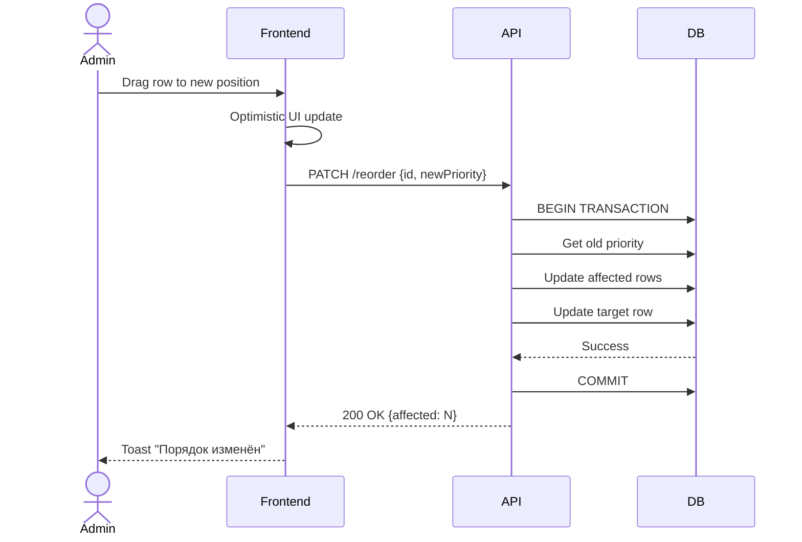
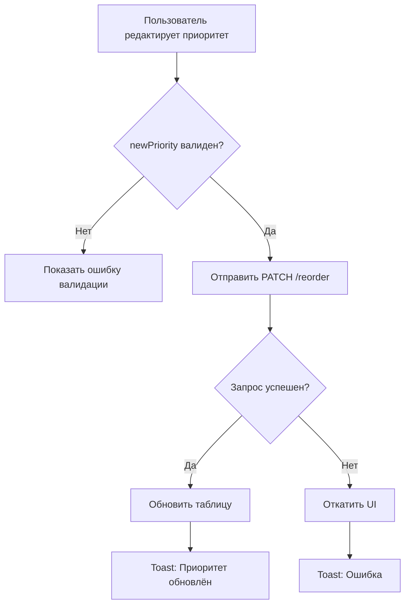

# ЧТЗ: Система приоритетов номенклатуры в справочниках

## Версия: 1.0 (согласовано)
## Дата создания: 10.03.2026
## Дата согласования: 10.03.2026
## Автор: Business/System Analyst
## Приоритет: High
## Статус: ✅ Согласовано, готово к разработке

---

## 1. Общая информация

### 1.1 Название проекта
Система приоритетов номенклатуры в справочниках материалов

### 1.2 Версия документа
1.0 (согласовано 10.03.2026)

### 1.3 Ответственные
- Инициатор: Заказчик
- Аналитик: Business/System Analyst
- Техлид: TBD

### 1.4 Приоритет
**High** - критичный функционал для управления порядком отображения номенклатуры

---

## 2. Цели и задачи

### 2.1 Бизнес-цель
Реализовать единую систему управления порядком отображения номенклатуры во всех справочниках материалов с возможностью перетаскивания (drag-and-drop), ручного редактирования приоритета и автоматическим пересчётом приоритетов при изменениях.

### 2.2 Пользовательская ценность
- Контроль порядка отображения номенклатуры на фронтенде калькулятора
- Возможность выделить приоритетные позиции (вывести в топ списка)
- Удобное управление порядком через drag-and-drop или ручной ввод
- Визуальное понимание текущего приоритета каждой позиции

### 2.3 Ключевые метрики успеха
- 100% справочников материалов имеют поле priority
- Drag-and-drop корректно пересчитывает приоритеты всех затронутых записей
- Уникальность приоритета гарантируется на уровне БД и API
- Ручное изменение приоритета корректно сдвигает соседние записи

---

## 3. Требования к продукту

### 3.1 Функциональные требования

#### 3.1.1 Область применения

Система приоритетов применяется к следующим справочникам материалов:

| Модель | Название | Текущее поле сортировки |
|--------|----------|------------------------|
| ProfnastilType | Профнастил | sortOrder |
| PicketType | Евроштакетник | sortOrder |
| PostType | Столбы | - |
| LagType | Лаги | - |
| GateType | Ворота | - |
| WicketType | Калитки | - |
| FenceType | Типы заборов | sortOrder |

#### 3.1.2 Автоматическое назначение приоритета

**User Story 1: Автоматическое назначение приоритета при создании**
*Как администратор, я хочу, чтобы при создании новой номенклатуры ей автоматически назначался приоритет в конец списка.*

**Правила назначения:**
- При создании: `priority = MAX(priority) + 1` в рамках справочника
- Если справочник пуст: `priority = 1`
- Приоритет назначается на backend перед сохранением

**Acceptance Criteria:**
- При создании первой записи в пустом справочнике priority = 1
- При создании последующих записей priority = MAX + 1
- Пользователь НЕ вводит приоритет вручную при создании
- После создания запись отображается в конце списка

#### 3.1.3 Уникальность приоритета

**User Story 2: Валидация уникальности приоритета**
*Как система, я должна гарантировать, что приоритет уникален в рамках одного справочника.*

**Правила валидации:**
- На уровне БД: UNIQUE constraint для поля priority (для каждой таблицы отдельно)
- На уровне API: проверка перед сохранением
- При попытке создать дублирующий приоритет — ошибка 409 Conflict

**Acceptance Criteria:**
- UNIQUE constraint добавлен для поля priority во всех таблицах
- API возвращает 409 Conflict при дублировании приоритета
- Сообщение об ошибке: "Приоритет уже занят. Выберите другое значение."

#### 3.1.4 Ручное изменение приоритета

**User Story 3: Ручное изменение приоритета через колонку таблицы**
*Как администратор, я хочу изменить приоритет номенклатуры, введя новое значение в колонку приоритета.*

**Правила пересчёта при ручном изменении:**

**Сценарий A: Увеличение приоритета (движение вниз)**
```
Пример: Меняем priority с 2 на 5

Было:                      Стало:
ID=1, priority=1           ID=1, priority=1
ID=2, priority=2 → 5       ID=2, priority=5  ← изменён
ID=3, priority=3           ID=3, priority=2  ← сдвинут вверх
ID=4, priority=4           ID=4, priority=3  ← сдвинут вверх
ID=5, priority=5           ID=5, priority=4  ← сдвинут вверх
```

**Сценарий B: Уменьшение приоритета (движение вверх)**
```
Пример: Меняем priority с 5 на 2

Было:                      Стало:
ID=1, priority=1           ID=1, priority=1
ID=2, priority=2           ID=2, priority=3  ← сдвинут вниз
ID=3, priority=3           ID=3, priority=4  ← сдвинут вниз
ID=4, priority=4           ID=4, priority=5  ← сдвинут вниз
ID=5, priority=5 → 2       ID=5, priority=2  ← изменён
```

**Формула пересчёта:**
```sql
-- При newPriority > oldPriority (движение вниз):
UPDATE table SET priority = priority - 1 
WHERE priority > oldPriority AND priority <= newPriority
AND id != targetId;

-- При newPriority < oldPriority (движение вверх):
UPDATE table SET priority = priority + 1 
WHERE priority >= newPriority AND priority < oldPriority
AND id != targetId;

-- Затем обновляем целевую запись:
UPDATE table SET priority = newPriority WHERE id = targetId;
```

**Acceptance Criteria:**
- Колонка "Приоритет" отображается в таблице справочника
- Значение приоритета можно редактировать inline (double-click или кнопка)
- При вводе нового приоритета происходит автоматический пересчёт
- Валидация: приоритет должен быть >= 1
- Валидация: приоритет не может превышать общее количество записей
- Показывается toast "Приоритет успешно изменён"
- Таблица обновляется с новой сортировкой

#### 3.1.5 Drag-and-drop изменение приоритета

**User Story 4: Изменение приоритета через drag-and-drop**
*Как администратор, я хочу перетащить номенклатуру на нужную позицию мышью для быстрого изменения порядка.*

**UI элементы:**
- Drag handle (иконка ⋮⋮) слева от каждой строки таблицы
- Курсор меняется на `grab` при наведении на drag handle
- При перетаскивании: курсор `grabbing`
- Подсветка строки-источника и строки-цели
- Пунктирная линия показывает место вставки

**Логика пересчёта:**
- Аналогично ручному изменению (см. 3.1.4)
- Оптимистичное обновление UI (показываем сразу, затем подтверждаем с сервером)

**Acceptance Criteria:**
- Drag handle отображается в первой колонке таблицы
- Перетаскивание работает плавно без задержек
- Визуальная индикация при перетаскивании (подсветка, линия вставки)
- При отпускании — API запрос на изменение приоритета
- При ошибке — отмена изменений и toast с ошибкой
- При успехе — toast "Порядок успешно изменён"
- Таблица сортируется по приоритету по умолчанию

#### 3.1.6 Отображение колонки приоритета

**User Story 5: Отображение приоритета в таблице**
*Как администратор, я хочу видеть текущий приоритет каждой номенклатуры в отдельной колонке.*

**Формат отображения:**
| Колонка | Позиция | Ширина | Выравнивание |
|---------|---------|--------|--------------|
| Drag Handle | 1 | 40px | Центр |
| Приоритет | 2 | 80px | Центр |
| ...остальные колонки... | ... | ... | ... |

**Свойства колонки "Приоритет":**
- Числовое значение (1, 2, 3...)
- Редактируемое (inline edit)
- Сортируемое
- Фильтрации нет

**Acceptance Criteria:**
- Колонка "Приоритет" отображается во всех справочниках материалов
- По умолчанию таблица отсортирована по priority ASC
- Значение можно редактировать inline
- Сортировка по колонке работает

---

### 3.2 Нефункциональные требования

#### 3.2.1 Производительность
- Время пересчёта приоритетов < 200ms (до 1000 записей)
- Drag-and-drop работает плавно (60 FPS)
- Оптимистичное обновление UI для мгновенного отклика

#### 3.2.2 Безопасность
- Авторизация: ADMIN, MANAGER
- Валидация приоритета на сервере
- Защита от race conditions при одновременном изменении

#### 3.2.3 Надёжность
- Транзакционность при пересчёте приоритетов
- Откат при ошибке
- Логирование изменений приоритетов

---

## 4. Техническая архитектура

### 4.1 Изменения в схеме данных

#### 4.1.1 ProfnastilType (переименование)
```prisma
model ProfnastilType {
  // ... существующие поля ...
  priority  Int  @default(0)  // переименовано из sortOrder
  
  @@index([priority])
}
```

#### 4.1.2 PicketType (переименование)
```prisma
model PicketType {
  // ... существующие поля ...
  priority  Int  @default(0)  // переименовано из sortOrder
  
  @@index([priority])
}
```

#### 4.1.3 PostType (новое поле)
```prisma
model PostType {
  // ... существующие поля ...
  priority  Int  @default(0)  // добавлено
  
  @@index([priority])
}
```

#### 4.1.4 LagType (новое поле)
```prisma
model LagType {
  // ... существующие поля ...
  priority  Int  @default(0)  // добавлено
  
  @@index([priority])
}
```

#### 4.1.5 GateType (новое поле)
```prisma
model GateType {
  // ... существующие поля ...
  priority  Int  @default(0)  // добавлено
  
  @@index([priority])
}
```

#### 4.1.6 WicketType (новое поле)
```prisma
model WicketType {
  // ... существующие поля ...
  priority  Int  @default(0)  // добавлено
  
  @@index([priority])
}
```

#### 4.1.7 FenceType (переименование)
```prisma
model FenceType {
  // ... существующие поля ...
  priority  Int  @default(0)  // переименовано из sortOrder
  
  @@index([priority])
}
```

### 4.2 Миграция данных

#### Migration Script
```sql
-- Migration: add_priority_to_references
-- Date: 2026-03-10

BEGIN;

-- ProfnastilType: переименовать sortOrder -> priority и заполнить
ALTER TABLE "ProfnastilType" RENAME COLUMN "sortOrder" TO "priority";
CREATE INDEX "ProfnastilType_priority_idx" ON "ProfnastilType"("priority");

-- PicketType: переименовать sortOrder -> priority и заполнить
ALTER TABLE "PicketType" RENAME COLUMN "sortOrder" TO "priority";
CREATE INDEX "PicketType_priority_idx" ON "PicketType"("priority");

-- PostType: добавить поле priority и заполнить на основе createdAt
ALTER TABLE "PostType" ADD COLUMN "priority" INTEGER NOT NULL DEFAULT 0;
CREATE INDEX "PostType_priority_idx" ON "PostType"("priority");

-- Заполняем priority на основе порядка создания
WITH ranked AS (
  SELECT id, ROW_NUMBER() OVER (ORDER BY "createdAt") as new_priority
  FROM "PostType"
)
UPDATE "PostType" SET "priority" = ranked.new_priority
FROM ranked WHERE "PostType".id = ranked.id;

-- LagType: добавить поле priority
ALTER TABLE "LagType" ADD COLUMN "priority" INTEGER NOT NULL DEFAULT 0;
CREATE INDEX "LagType_priority_idx" ON "LagType"("priority");

WITH ranked AS (
  SELECT id, ROW_NUMBER() OVER (ORDER BY "createdAt") as new_priority
  FROM "LagType"
)
UPDATE "LagType" SET "priority" = ranked.new_priority
FROM ranked WHERE "LagType".id = ranked.id;

-- GateType: добавить поле priority
ALTER TABLE "GateType" ADD COLUMN "priority" INTEGER NOT NULL DEFAULT 0;
CREATE INDEX "GateType_priority_idx" ON "GateType"("priority");

WITH ranked AS (
  SELECT id, ROW_NUMBER() OVER (ORDER BY "createdAt") as new_priority
  FROM "GateType"
)
UPDATE "GateType" SET "priority" = ranked.new_priority
FROM ranked WHERE "GateType".id = ranked.id;

-- WicketType: добавить поле priority
ALTER TABLE "WicketType" ADD COLUMN "priority" INTEGER NOT NULL DEFAULT 0;
CREATE INDEX "WicketType_priority_idx" ON "WicketType"("priority");

WITH ranked AS (
  SELECT id, ROW_NUMBER() OVER (ORDER BY "createdAt") as new_priority
  FROM "WicketType"
)
UPDATE "WicketType" SET "priority" = ranked.new_priority
FROM ranked WHERE "WicketType".id = ranked.id;

-- FenceType: переименовать sortOrder -> priority
ALTER TABLE "FenceType" RENAME COLUMN "sortOrder" TO "priority";
CREATE INDEX "FenceType_priority_idx" ON "FenceType"("priority");

COMMIT;
```

#### Rollback Script
```sql
-- Rollback: add_priority_to_references
-- Date: 2026-03-10

BEGIN;

-- ProfnastilType
DROP INDEX IF EXISTS "ProfnastilType_priority_idx";
ALTER TABLE "ProfnastilType" RENAME COLUMN "priority" TO "sortOrder";

-- PicketType
DROP INDEX IF EXISTS "PicketType_priority_idx";
ALTER TABLE "PicketType" RENAME COLUMN "priority" TO "sortOrder";

-- PostType
DROP INDEX IF EXISTS "PostType_priority_idx";
ALTER TABLE "PostType" DROP COLUMN "priority";

-- LagType
DROP INDEX IF EXISTS "LagType_priority_idx";
ALTER TABLE "LagType" DROP COLUMN "priority";

-- GateType
DROP INDEX IF EXISTS "GateType_priority_idx";
ALTER TABLE "GateType" DROP COLUMN "priority";

-- WicketType
DROP INDEX IF EXISTS "WicketType_priority_idx";
ALTER TABLE "WicketType" DROP COLUMN "priority";

-- FenceType
DROP INDEX IF EXISTS "FenceType_priority_idx";
ALTER TABLE "FenceType" RENAME COLUMN "priority" TO "sortOrder";

COMMIT;
```

### 4.3 Архитектура компонентов

```
src/
├── lib/
│   ├── utils/
│   │   └── priorityUtils.ts              # Утилиты пересчёта приоритетов
│   └── hooks/
│       └── usePriorityReorder.ts         # Хук для drag-and-drop
├── components/
│   └── admin/
│       └── References/
│           ├── shared/
│           │   ├── PriorityColumn.tsx    # Компонент колонки приоритета
│           │   ├── DragHandle.tsx        # Компонент drag handle
│           │   └── ReorderableTable.tsx  # HOC для таблиц с drag-and-drop
│           └── ... (существующие компоненты справочников)
└── app/api/admin/
    └── [entity]/
        └── reorder/
            └── route.ts                  # API endpoint для пересчёта
```

---

## 5. API спецификация

### 5.1 PATCH /api/admin/{entity}/reorder

**Auth:** Required (ADMIN, MANAGER)

**Path Parameters:**
| Параметр | Описание | Примеры |
|----------|----------|---------|
| entity | Тип справочника | profnastil-types, picket-types, post-types, lag-types, gate-types, wicket-types, fence-types |

**Request:**
```json
{
  "id": "clh123abc...",
  "newPriority": 1
}
```

**Validation:**
```typescript
const reorderSchema = z.object({
  id: z.string().cuid(),
  newPriority: z.number().int().min(1)
});
```

**Response 200:**
```json
{
  "success": true,
  "affected": 4,
  "item": {
    "id": "clh123abc...",
    "priority": 1
  }
}
```

**Response 400 (invalid priority):**
```json
{
  "error": "Bad Request",
  "message": "Приоритет должен быть от 1 до 150"
}
```

**Response 404 (not found):**
```json
{
  "error": "Not Found",
  "message": "Запись не найдена"
}
```

### 5.2 Обновление существующих endpoints

#### GET /api/admin/{entity}
- Добавить сортировку по `priority ASC` по умолчанию
- Добавить поле `priority` в response

#### POST /api/admin/{entity}
- Автоматически назначать `priority = MAX(priority) + 1`
- Не принимать `priority` от клиента при создании

#### PUT /api/admin/{entity}/:id
- Добавить возможность обновления `priority` (если передан)
- При обновлении priority — вызывать логику пересчёта

---

## 6. UI/UX требования

### 6.1 Макет таблицы с drag-and-drop

```
┌────────────────────────────────────────────────────────────────────────────┐
│ Справочник: Профнастил                                   [+ Создать]       │
├────────────────────────────────────────────────────────────────────────────┤
│                                                                            │
│ ┌──┬─────────┬────────────────────┬─────────┬────────┬─────────┬────────┐ │
│ │⋮⋮│ Приор.  │ Название           │ Толщина │ Ширина │ ...     │ Действ.│ │
│ ├──┼─────────┼────────────────────┼─────────┼────────┼─────────┼────────┤ │
│ │⋮⋮│ 1 ✓     │ С8 0.5мм           │ 0.5     │ 1150   │ ...     │ ✎ ✗   │ │
│ │⋮⋮│ 2       │ С8 0.7мм           │ 0.7     │ 1150   │ ...     │ ✎ ✗   │ │
│ │⋮⋮│ 3       │ С20 0.5мм          │ 0.5     │ 1100   │ ...     │ ✎ ✗   │ │
│ │⋮⋮│ 4       │ С20 0.7мм          │ 0.7     │ 1100   │ ...     │ ✎ ✗   │ │
│ └──┴─────────┴────────────────────┴─────────┴────────┴─────────┴────────┘ │
│                                                                            │
│ 💡 Перетащите строку за ⋮⋮ для изменения порядка                          │
│                                                                            │
└────────────────────────────────────────────────────────────────────────────┘
```

### 6.2 Состояния drag-and-drop

**Normal:**
```
│⋮⋮│ 2       │ С8 0.7мм           │ ...
```

**Hover on drag handle:**
```
│⋮⋮│ 2       │ С8 0.7мм           │ ...  ← курсор: grab
 ↑ подсвечен
```

**Dragging:**
```
│  │         │                    │ ...  ← пунктирная линия (placeholder)
│⋮⋮│ 2       │ С8 0.7мм           │ ...  ← полупрозрачная строка следует за курсором
```

**Drop target:**
```
│⋮⋮│ 1       │ С8 0.5мм           │ ...
├──┼─────────┼────────────────────┤ ← линия вставки
│⋮⋮│ 2       │ С8 0.7мм           │ ...
```

### 6.3 Inline редактирование приоритета

**Normal:**
```
│ 2       │
```

**Edit mode (double-click):**
```
│ [2    ] │  ← input с числом
```

**Validation error:**
```
│ [0    ] │
│ ⚠ Мин. значение: 1
```

### 6.4 Toast notifications

| Событие | Toast |
|---------|-------|
| Drag-and-drop успех | ✅ Порядок успешно изменён |
| Drag-and-drop ошибка | ❌ Ошибка изменения порядка |
| Inline edit успех | ✅ Приоритет обновлён |
| Валидация | ⚠️ Приоритет должен быть от 1 до N |

---

## 7. Тестирование

### 7.1 Unit-тесты

**Файл:** `__tests__/lib/utils/priorityUtils.test.ts`

```typescript
describe('Priority Utils', () => {
  describe('calculateReorderUpdates', () => {
    test('should calculate updates when moving up (5 -> 2)', () => {
      const result = calculateReorderUpdates({
        id: 'item-5',
        oldPriority: 5,
        newPriority: 2,
        allItems: [
          { id: 'item-1', priority: 1 },
          { id: 'item-2', priority: 2 },
          { id: 'item-3', priority: 3 },
          { id: 'item-4', priority: 4 },
          { id: 'item-5', priority: 5 },
        ]
      });
      
      expect(result).toEqual([
        { id: 'item-2', priority: 3 },
        { id: 'item-3', priority: 4 },
        { id: 'item-4', priority: 5 },
        { id: 'item-5', priority: 2 },
      ]);
    });

    test('should calculate updates when moving down (2 -> 5)', () => {
      const result = calculateReorderUpdates({
        id: 'item-2',
        oldPriority: 2,
        newPriority: 5,
        allItems: [
          { id: 'item-1', priority: 1 },
          { id: 'item-2', priority: 2 },
          { id: 'item-3', priority: 3 },
          { id: 'item-4', priority: 4 },
          { id: 'item-5', priority: 5 },
        ]
      });
      
      expect(result).toEqual([
        { id: 'item-3', priority: 2 },
        { id: 'item-4', priority: 3 },
        { id: 'item-5', priority: 4 },
        { id: 'item-2', priority: 5 },
      ]);
    });

    test('should return empty array when priority unchanged', () => {
      const result = calculateReorderUpdates({
        id: 'item-2',
        oldPriority: 2,
        newPriority: 2,
        allItems: []
      });
      
      expect(result).toEqual([]);
    });
  });

  describe('getNextPriority', () => {
    test('should return 1 for empty table', () => {
      expect(getNextPriority([])).toBe(1);
    });

    test('should return MAX + 1', () => {
      const items = [
        { id: '1', priority: 1 },
        { id: '2', priority: 5 },
        { id: '3', priority: 3 },
      ];
      expect(getNextPriority(items)).toBe(6);
    });
  });
});
```

### 7.2 Integration-тесты

**Файл:** `__tests__/api/admin/reorder.test.ts`

```typescript
describe('Reorder API', () => {
  test('should reorder items when moving up', async () => {
    // Создаём тестовые данные
    const items = await createTestItems([
      { name: 'Item 1', priority: 1 },
      { name: 'Item 2', priority: 2 },
      { name: 'Item 3', priority: 3 },
      { name: 'Item 4', priority: 4 },
      { name: 'Item 5', priority: 5 },
    ]);

    const response = await request(app)
      .patch('/api/admin/profnastil-types/reorder')
      .set('Authorization', `Bearer ${adminToken}`)
      .send({
        id: items[4].id,
        newPriority: 2
      });

    expect(response.status).toBe(200);
    expect(response.body.affected).toBe(4);

    // Проверяем итоговый порядок
    const updated = await getItems();
    expect(updated[0].priority).toBe(1);
    expect(updated[1].priority).toBe(2);
    expect(updated[1].name).toBe('Item 5'); // перемещённый
  });

  test('should assign next priority on create', async () => {
    await createTestItems([
      { name: 'Item 1', priority: 1 },
      { name: 'Item 2', priority: 2 },
    ]);

    const response = await request(app)
      .post('/api/admin/profnastil-types')
      .set('Authorization', `Bearer ${adminToken}`)
      .send({
        name: 'Item 3',
        // priority НЕ передаётся
        metalThickness: 0.5,
        // ... другие обязательные поля
      });

    expect(response.status).toBe(201);
    
    const newItem = await getItem(response.body.id);
    expect(newItem.priority).toBe(3);
  });

  test('should reject invalid priority', async () => {
    const items = await createTestItems([
      { name: 'Item 1', priority: 1 },
    ]);

    const response = await request(app)
      .patch('/api/admin/profnastil-types/reorder')
      .set('Authorization', `Bearer ${adminToken}`)
      .send({
        id: items[0].id,
        newPriority: 0  // невалидное значение
      });

    expect(response.status).toBe(400);
  });
});
```

### 7.3 E2E-тесты

```typescript
test('Admin can reorder items via drag-and-drop', async ({ page }) => {
  await page.goto('/admin/references/profnastil');
  
  // Проверяем начальный порядок
  await expect(page.locator('table tbody tr:first-child td:nth-child(2)')).toHaveText('1');
  await expect(page.locator('table tbody tr:last-child td:nth-child(2)')).toHaveText('5');

  // Перетаскиваем последнюю строку на первую позицию
  const lastRow = page.locator('table tbody tr:last-child');
  const firstRow = page.locator('table tbody tr:first-child');
  
  await lastRow.locator('.drag-handle').dragTo(firstRow);

  // Проверяем toast
  await expect(page.locator('text=Порядок успешно изменён')).toBeVisible();

  // Проверяем новый порядок
  await expect(page.locator('table tbody tr:first-child td:nth-child(2)')).toHaveText('1');
  // Бывшая последняя строка теперь первая
});

test('Admin can edit priority inline', async ({ page }) => {
  await page.goto('/admin/references/profnastil');
  
  // Двойной клик на ячейку приоритета
  await page.locator('table tbody tr:first-child td:nth-child(2)').dblclick();
  
  // Вводим новое значение
  await page.locator('input[name="priority"]').fill('3');
  await page.keyboard.press('Enter');
  
  // Проверяем toast
  await expect(page.locator('text=Приоритет обновлён')).toBeVisible();
});
```

### 7.4 Целевое покрытие тестами
- Unit-тесты: ≥80% покрытие priorityUtils
- Integration-тесты: все API endpoints reorder
- E2E-тесты: drag-and-drop и inline edit для 2 справочников

---

## 8. Декомпозиция на задачи

### TASK-BCK-001: Обновление Prisma схемы

**Направление:** Backend  
**Приоритет:** High  
**Оценка:** 2 часа  
**Зависимости:** Нет

**Описание:**
Обновить схему Prisma: переименовать sortOrder -> priority и добавить priority в модели без этого поля.

**Критерии приемки:**
- [ ] ProfnastilType.sortOrder переименован в priority
- [ ] PicketType.sortOrder переименован в priority
- [ ] FenceType.sortOrder переименован в priority
- [ ] PostType.priority добавлен
- [ ] LagType.priority добавлен
- [ ] GateType.priority добавлен
- [ ] WicketType.priority добавлен
- [ ] Индексы на priority созданы для всех моделей
- [ ] Миграция создана и протестирована
- [ ] Rollback скрипт создан

**Технические детали:**
- Файл: `prisma/schema.prisma`
- Команда: `npx prisma migrate dev --name add_priority_to_references`

---

### TASK-BCK-002: Создание утилит пересчёта приоритетов

**Направление:** Backend  
**Приоритет:** High  
**Оценка:** 2 часа  
**Зависимости:** TASK-BCK-001

**Описание:**
Создать утилиты для расчёта обновлений приоритетов при перемещении.

**Критерии приемки:**
- [ ] Функция calculateReorderUpdates создана
- [ ] Функция getNextPriority создана
- [ ] Обработка edge cases (пустой список, 1 элемент)
- [ ] Unit-тесты написаны (≥80% покрытие)

**Технические детали:**
- Файл: `src/lib/utils/priorityUtils.ts`
- Тесты: `__tests__/lib/utils/priorityUtils.test.ts`

---

### TASK-BCK-003: Создание API endpoint reorder

**Направление:** Backend  
**Приоритет:** High  
**Оценка:** 3 часа  
**Зависимости:** TASK-BCK-002

**Описание:**
Создать универсальный API endpoint для пересчёта приоритетов.

**Критерии приемки:**
- [ ] PATCH /api/admin/profnastil-types/reorder
- [ ] PATCH /api/admin/picket-types/reorder
- [ ] PATCH /api/admin/post-types/reorder
- [ ] PATCH /api/admin/lag-types/reorder
- [ ] PATCH /api/admin/gate-types/reorder
- [ ] PATCH /api/admin/wicket-types/reorder
- [ ] PATCH /api/admin/fence-types/reorder
- [ ] Валидация newPriority
- [ ] Транзакционность обновления
- [ ] Integration-тесты написаны

**Технические детали:**
- Файлы: `src/app/api/admin/*/reorder/route.ts`
- Использовать $transaction для атомарности

---

### TASK-BCK-004: Обновление существующих API endpoints

**Направление:** Backend  
**Приоритет:** High  
**Оценка:** 2 часа  
**Зависимости:** TASK-BCK-001

**Описание:**
Обновить существующие CRUD endpoints для работы с priority.

**Критерии приемки:**
- [ ] GET endpoints возвращают записи отсортированными по priority ASC
- [ ] POST endpoints автоматически назначают priority = MAX + 1
- [ ] PUT endpoints поддерживают обновление priority
- [ ] При обновлении priority вызывается логика пересчёта

**Технические детали:**
- Файлы: `src/app/api/admin/*/route.ts`
- Сервисы: `src/services/admin/*Service.ts`

---

### TASK-FRT-001: Создание компонента PriorityColumn

**Направление:** Frontend  
**Приоритет:** High  
**Оценка:** 2 часа  
**Зависимости:** TASK-BCK-003

**Описание:**
Создать reusable компонент для отображения и редактирования приоритета.

**Критерии приемки:**
- [ ] Компонент PriorityColumn создан
- [ ] Inline редактирование (double-click)
- [ ] Валидация ввода (min: 1, max: totalItems)
- [ ] Toast при успехе/ошибке
- [ ] Props: value, onChange, min, max, disabled

**Технические детали:**
- Файл: `src/components/admin/References/shared/PriorityColumn.tsx`
- Использовать shadcn/ui Input, Tooltip

---

### TASK-FRT-002: Создание компонента DragHandle

**Направление:** Frontend  
**Приоритет:** High  
**Оценка:** 1 час  
**Зависимости:** Нет

**Описание:**
Создать компонент drag handle для таблиц.

**Критерии приемки:**
- [ ] Иконка ⋮⋮ отображается
- [ ] Курсор grab/grabbing
- [ ] Визуальная подсветка при hover
- [ ] Tooltip: "Перетащите для изменения порядка"

**Технические детали:**
- Файл: `src/components/admin/References/shared/DragHandle.tsx`

---

### TASK-FRT-003: Создание HOC ReorderableTable

**Направление:** Frontend  
**Приоритет:** High  
**Оценка:** 4 часа  
**Зависимости:** TASK-FRT-002, TASK-BCK-003

**Описание:**
Создать Higher-Order Component для добавления drag-and-drop к таблицам.

**Критерии приемки:**
- [ ] HOC withReorder создан
- [ ] Drag-and-drop работает (dnd-kit или react-beautiful-dnd)
- [ ] Оптимистичное обновление UI
- [ ] API вызов при drop
- [ ] Rollback при ошибке
- [ ] Визуальная индикация при перетаскивании

**Технические детали:**
- Файл: `src/components/admin/References/shared/ReorderableTable.tsx`
- Библиотека: @dnd-kit/core, @dnd-kit/sortable

---

### TASK-FRT-004: Интеграция в справочник Профнастил

**Направление:** Frontend  
**Приоритет:** High  
**Оценка:** 2 часа  
**Зависимости:** TASK-FRT-001, TASK-FRT-003

**Описание:**
Интегрировать систему приоритетов в таблицу Профнастила.

**Критерии приемки:**
- [ ] Колонка DragHandle добавлена
- [ ] Колонка Приоритет добавлена
- [ ] Drag-and-drop работает
- [ ] Inline редактирование работает
- [ ] Сортировка по priority по умолчанию

**Технические детали:**
- Файл: `src/components/admin/References/ProfnastilTable.tsx`

---

### TASK-FRT-005: Интеграция в справочник Евроштакетник

**Направление:** Frontend  
**Приоритет:** High  
**Оценка:** 2 часа  
**Зависимости:** TASK-FRT-001, TASK-FRT-003

**Описание:**
Интегрировать систему приоритетов в таблицу Евроштакетника.

**Критерии приемки:**
- Аналогично TASK-FRT-004

**Технические детали:**
- Файл: `src/components/admin/References/PicketTable.tsx`

---

### TASK-FRT-006: Интеграция в справочник Столбы

**Направление:** Frontend  
**Приоритет:** Medium  
**Оценка:** 2 часа  
**Зависимости:** TASK-FRT-001, TASK-FRT-003

**Описание:**
Интегрировать систему приоритетов в таблицу Столбов.

**Критерии приемки:**
- Аналогично TASK-FRT-004

**Технические детали:**
- Файл: `src/components/admin/References/PostTable.tsx`

---

### TASK-FRT-007: Интеграция в справочник Лаги

**Направление:** Frontend  
**Приоритет:** Medium  
**Оценка:** 2 часа  
**Зависимости:** TASK-FRT-001, TASK-FRT-003

**Описание:**
Интегрировать систему приоритетов в таблицу Лаг.

**Критерии приемки:**
- Аналогично TASK-FRT-004

**Технические детали:**
- Файл: `src/components/admin/References/LagTable.tsx`

---

### TASK-FRT-008: Интеграция в справочник Ворота

**Направление:** Frontend  
**Приоритет:** Medium  
**Оценка:** 2 часа  
**Зависимости:** TASK-FRT-001, TASK-FRT-003

**Описание:**
Интегрировать систему приоритетов в таблицу Ворот.

**Критерии приемки:**
- Аналогично TASK-FRT-004

**Технические детали:**
- Файл: `src/components/admin/References/GateTable.tsx`

---

### TASK-FRT-009: Интеграция в справочник Калитки

**Направление:** Frontend  
**Приоритет:** Medium  
**Оценка:** 2 часа  
**Зависимости:** TASK-FRT-001, TASK-FRT-003

**Описание:**
Интегрировать систему приоритетов в таблицу Калиток.

**Критерии приемки:**
- Аналогично TASK-FRT-004

**Технические детали:**
- Файл: `src/components/admin/References/WicketTable.tsx`

---

### TASK-FRT-010: Интеграция в справочник Типы заборов

**Направление:** Frontend  
**Приоритет:** Medium  
**Оценка:** 2 часа  
**Зависимости:** TASK-FRT-001, TASK-FRT-003

**Описание:**
Интегрировать систему приоритетов в таблицу Типов заборов.

**Критерии приемки:**
- Аналогично TASK-FRT-004

**Технические детали:**
- Файл: `src/components/admin/References/FenceTypeTable.tsx`

---

### TASK-TST-001: E2E тесты drag-and-drop

**Направление:** Testing  
**Приоритет:** High  
**Оценка:** 3 часа  
**Зависимости:** TASK-FRT-004

**Описание:**
Написать E2E тесты для проверки drag-and-drop функциональности.

**Критерии приемки:**
- [ ] Тест drag-and-drop перемещения
- [ ] Тест inline редактирования приоритета
- [ ] Тест валидации приоритета

**Технические детали:**
- Файл: `e2e/priority-reorder.spec.ts`
- Playwright

---

### TASK-DOC-001: Обновление документации

**Направление:** Documentation  
**Приоритет:** Medium  
**Оценка:** 1 час  
**Зависимости:** Все задачи

**Описание:**
Обновить документацию проекта.

**Критерии приемки:**
- [ ] API.md обновлён (новые endpoints)
- [ ] ARCHITECTURE.md обновлён (новые компоненты)
- [ ] README обновлён (если требуется)

---

## 9. Итерации и планы

### Итерация 1 (MVP) - 2 дня
- TASK-BCK-001: Prisma схема
- TASK-BCK-002: Утилиты пересчёта
- TASK-BCK-003: API reorder
- TASK-BCK-004: Обновление CRUD
- TASK-FRT-001: PriorityColumn
- TASK-FRT-002: DragHandle
- TASK-FRT-003: ReorderableTable
- TASK-FRT-004: Интеграция в Профнастил

### Итерация 2 - 2 дня
- TASK-FRT-005: Евроштакетник
- TASK-FRT-006: Столбы
- TASK-FRT-007: Лаги
- TASK-FRT-008: Ворота
- TASK-FRT-009: Калитки
- TASK-FRT-010: Типы заборов
- TASK-TST-001: E2E тесты
- TASK-DOC-001: Документация

---

## 10. Риски и зависимости

### 10.1 Риски

| Риск | Вероятность | Влияние | Митигация |
|------|-------------|---------|-----------|
| Race condition при одновременном изменении | Medium | High | Использовать транзакции и optimistic locking |
| Большой объём данных при пересчёте | Low | Medium | Пагинация, индексы, batch update |
| Сложность drag-and-drop на мобильных | Medium | Low | Desktop-first, touch fallback |

### 10.2 Зависимости
- Нет внешних зависимостей
- Требуется установка @dnd-kit/core, @dnd-kit/sortable

---

## 11. Согласование

### 11.1 Чек-лист согласования
- [x] Требования обсуждены с заказчиком
- [x] Получены ответы на все вопросы
- [x] Варианты решений представлены и обсуждены
- [x] Заказчик одобрил черновик
- [x] Фиксирована согласованная версия

### 11.2 Согласовано с
- Заказчик: ✅ 10.03.2026
- Аналитик: ✅ 10.03.2026

### 11.3 Версия для реализации
1.0

---

## 12. Диаграммы

### 12.1 Sequence Diagram: Изменение приоритета



### 12.2 Activity Diagram: Ручное изменение приоритета



---

## 13. Definition of Done

**Считать выполненным, когда:**
- [ ] Код написан и прошел code review
- [ ] Unit тесты написаны (≥80% покрытие priorityUtils)
- [ ] Integration тесты прошли
- [ ] E2E тесты прошли
- [ ] Документация обновлена
- [ ] Миграция протестирована на dev
- [ ] Ручное тестирование завершено
- [ ] Все 7 справочников интегрированы
